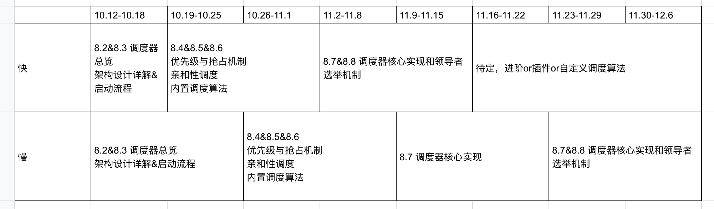

# Kubernetes 源码研习社

Kubernetes 源码研习社是由 [云原生社区](https://cloudnative.to) 组织的 Kubernetes 源码特别兴趣小组（SIG），由热爱学习、注重个人成长的一帮小伙伴们自由、自愿成立的小组。每个人都非常希望从 Kubernetes 上学到知识，帮助自己实现成长和进步。欢迎加入，一起坚持，一起克服，一起成长。

## 源码研习社第二期（进行中）

本期主题：kube-scheduler 源码剖析

活动时间：2020.10.12 开始

如何报名：[报名方式](###如何报名)

分享招募: [scheduler源码分享讲师招募](https://github.com/cloudnativeto/sig-k8s-source-code/blob/master/action/Kubernetes%E6%BA%90%E7%A0%81%E7%A0%94%E4%B9%A0%E7%A4%BE%E4%BA%8C%E6%9C%9F/schedluer%E6%BA%90%E7%A0%81%E5%88%86%E4%BA%AB%E8%AE%B2%E5%B8%88%E6%8B%9B%E5%8B%9F.md) 

### 活动介绍

Kubernetes 源码 scheduler 剖析，干就完事了。每周学习目标：

- 每周写笔记做总结。笔记链接：https://docs.qq.com/sheet/DR01kdWZkUmFLc0Jh?tab=o3eynn
- 每周六晚 7-10 点固定在线研讨 Kubernetes 调度器问题。腾讯会议号：4967324951
- 每日讨论 Kubernetes 源码问题
- 参阅本项目推荐的 kubernetes 相关文章

本期学习计划

坚持就是胜利

### 推荐资料

#### scheduler 原理解析

[Kubernetes Scheduler 设计与实现 【 Go 夜读 】](https://www.bilibili.com/video/BV1N7411w7M9?from=search&seid=14076379299193875526)

#### scheduler 源码剖析

[k8s scheduler 源码阅读 【 Go 夜读 】](https://www.bilibili.com/video/BV1gb411j7Z3?from=search&seid=17171641331878072459)

[kube-scheduler 源码分析 -- 作者 田雨飞](https://www.bookstack.cn/read/source-code-reading-notes/kubernetes-kube_scheduler_process.md)

[Kubernetes Scheduler 源码全解析-全景图](http://tang.love/2018/07/24/learning-kubernetes-source-code/)

[调度器核心数据结构与算法分析 -- 云原生学习笔记 -- 作者 baxiaoshi](https://www.yuque.com/baxiaoshi/tyado3/yw9deb)

[Kubernetes 源码分析之 kube-scheduler](https://juejin.im/post/6844903796120780814#heading-9)  

非常感谢社区[abserari](https://github.com/abserari)整理的以下的学习资料  
[源码研习社特供版图解scheduler](doc/pdf/Scheduler.pdf)  

#### scheduler 扩展开发

[自定义 Kubernetes 调度器](https://www.qikqiak.com/post/custom-kube-scheduler/)

#### scheduler 落地实践

#### scheduler 其他好料

[调度器 SIG](https://github.com/kubernetes/community/tree/master/sig-scheduling)

[scheduler 包括其他的一些组件相关解析](https://www.bookstack.cn/read/source-code-reading-notes/kubernetes-kube_scheduler_preempt.md)

[调度系统设计精要](https://draveness.me/system-design-scheduler/)

#### 阅读源码的建议

[如何高效阅读 Kubernetes 源码？](action/guide/kubernetes-源码阅读指引.md)

#### 欢迎贡献

合适的文章有非常多，如果有合适的欢迎提交 PR（Pull Request）合入推荐阅读文章。

### 你能收获什么？

- 对 Kubernetes 核心源码有更深刻的理解
- 一群热爱云原生的志同道合的朋友

### 如何报名

进入报名 excel 表，填写自己信息即被认为是报名参加活动，每周按要求完成总结笔记，参与每周周末的讨论即可

报名链接：https://docs.qq.com/sheet/DR01kdWZkUmFLc0Jh?tab=o3eynn

## 加入我们

源码研习社也有自己的微信群，如何加入？

扫描下面的二维码，添加 Jimmy Song 好友，备注姓名-公司，留言“加入源码研习社”即可。

## 嘉宾介绍

郑东旭（Derek Zheng） BFE（万亿流量转发引擎）开源项目的作者之一，《Kubernetes 源码剖析》作者，擅长 Linux 下高性能服务器的开发，对云计算、区块链相关技术领域有深刻的理解。

## 源码研习社 SIG 小组成员

SIG 的全称是 Special Interests Group, 或称 Super Intellectual Genius。
源码研习社 SIG 小组负责源码研习社活动的日常维护，目前的核心成员包括：

- [厉辉 yousali](https://github.com/Miss-you)
- 金润森
- 王文虎
- 赵卫国
- 王冬
- [梁远鹏](https://github.com/liangyuanpeng)

## Q&A:

关于本次活动有任何问题，请在 [Issue](https://github.com/cloudnativeto/sig-k8s-source-code/issues) 中提问，也可以参与 [社区会议](https://github.com/cloudnativeto/community/blob/master/README.md) 反馈。
