# API Server CustomResourceDefinitions

大家好，我是杨鼎睿，这一次给大家带来的是 API Server 的源码阅读。包括之前的 etcd 源码阅读，整个 API Server 共 109 张源码及源码图，文章最后有 API Server 系列目录。欢迎大家的阅读。

本文研究了 CRD 部分的源码，配备源码进行进一步理解，可以加深理解,增强相关设计能力。 

## ResourceConfig

### Default Configuration

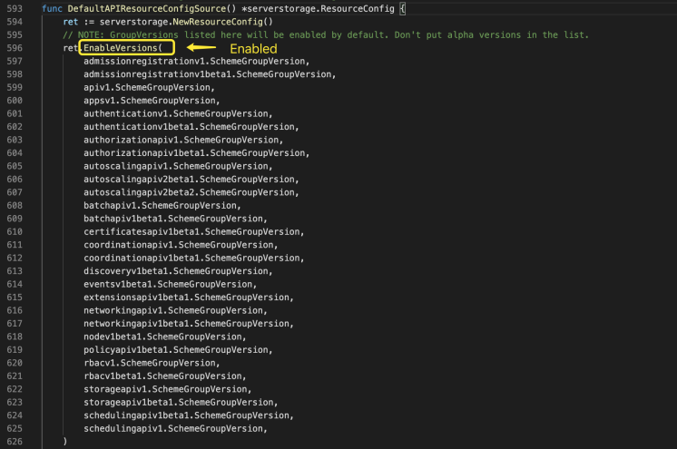

开启的资源配置及禁用的版本

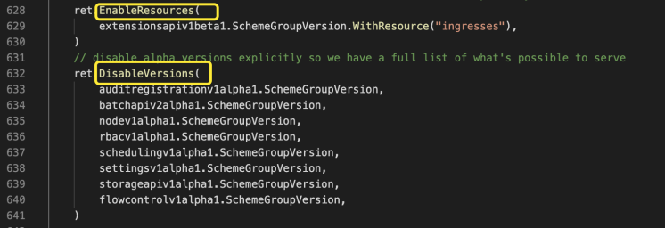

### Extend

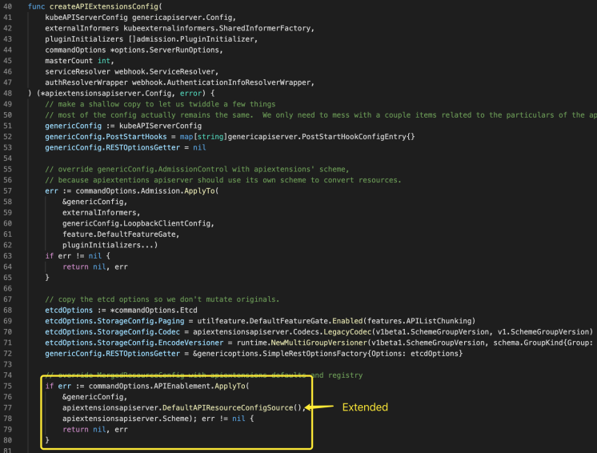

开启选型如下

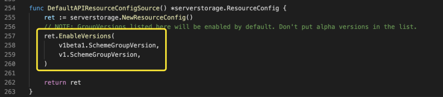

## Runtime Support

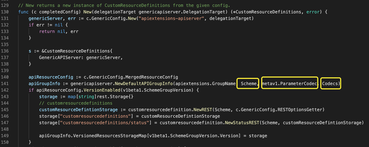

三者如下图所示

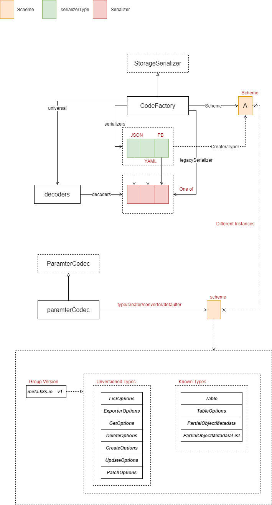

### Storage

#### Custom Resource Definitions

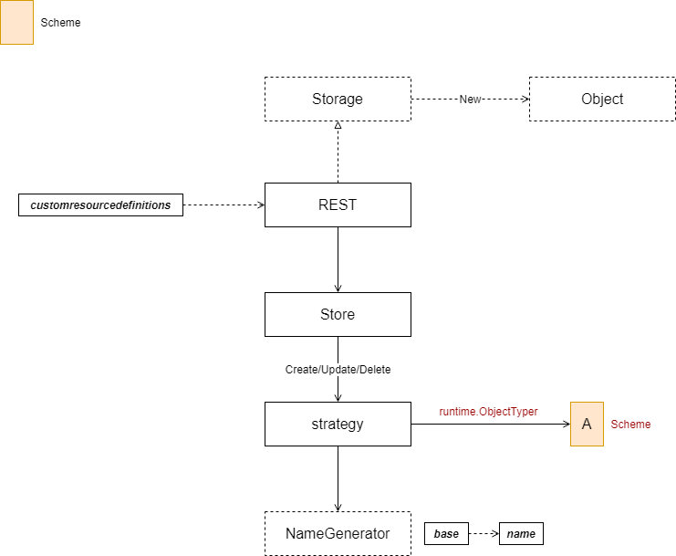

Store 展开后如下图所示

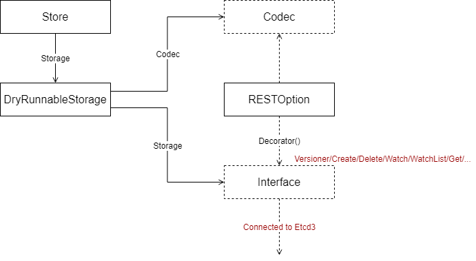

## State Transition

### Landscape

SharedInformerFactory 用于创建 SharedIndexInformer，后者会周期性的使用 Clientset 连接版本为 v1beta1 或 v1 的 API Extension Services，获取到状态变更后，通知各自的 ResourceEventHandler。在此，还有一些问题需要深入挖掘：

* SharedInformerFactory 如何区分不同类型的资源状态变更
* ResourceEventHandler 是否能同时关注不同类型资源状态的变更
* 资源状态变更是如何获取到的

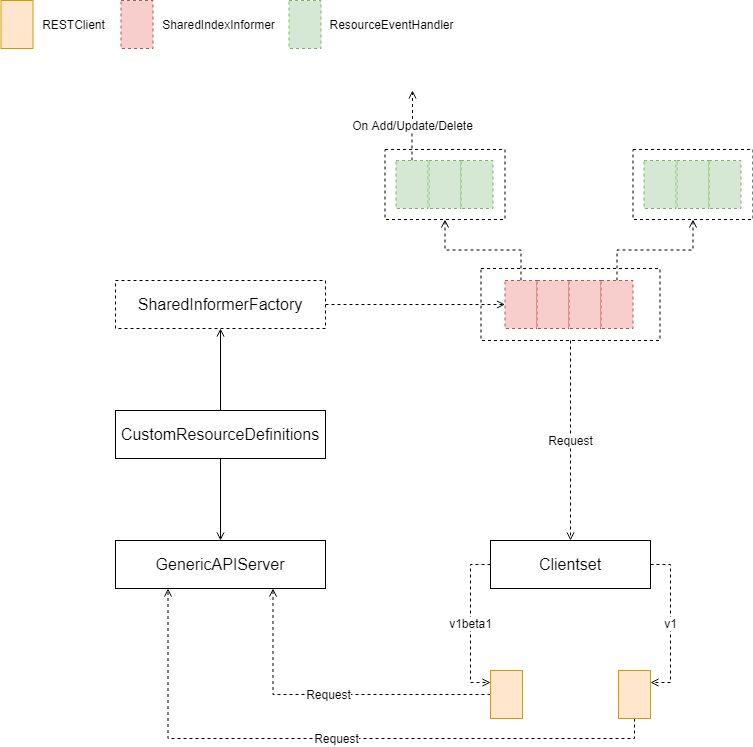

### Clientset

Clientset 功能相对简单，将可用的 API Extension Services 进行封装，每个 RESTClient 都连接在 "Loopback" 地址上，并向不同的服务发送请求。

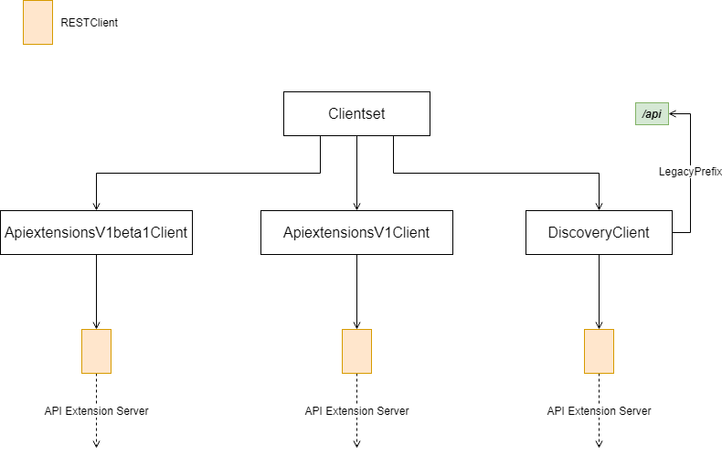

### SharedInformerFactory

#### Relationship

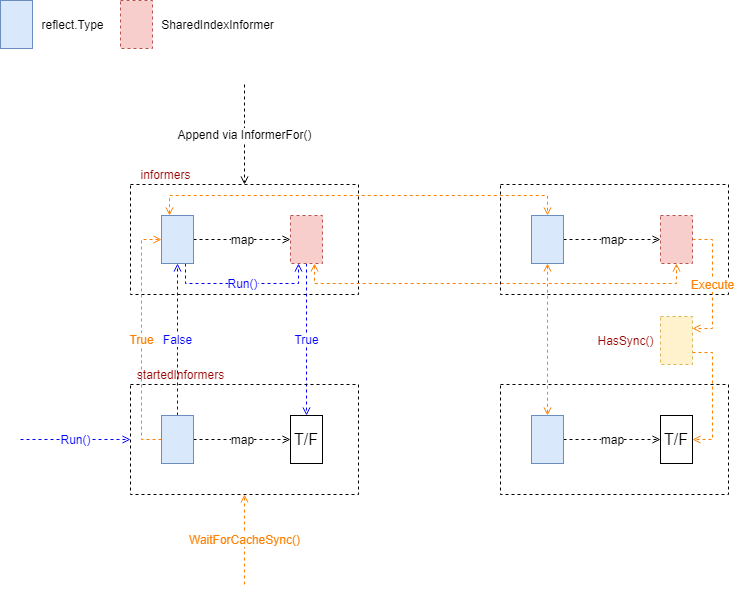

#### Add Informers

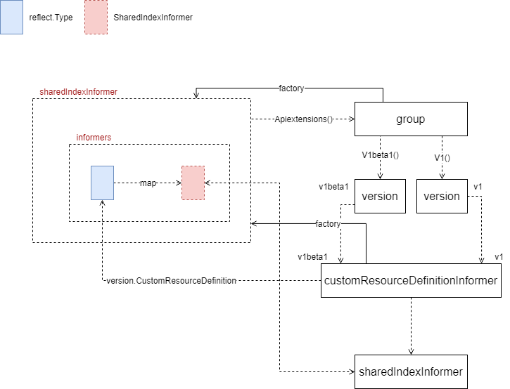

## Management

### EstablishingController

EstablishingController 启动后，会启动一个定时执行任务，这个任务每秒检查队列里是否有新的 **Key** 值，如果有，则更新 Server 端对应资源状态为 **Established**。

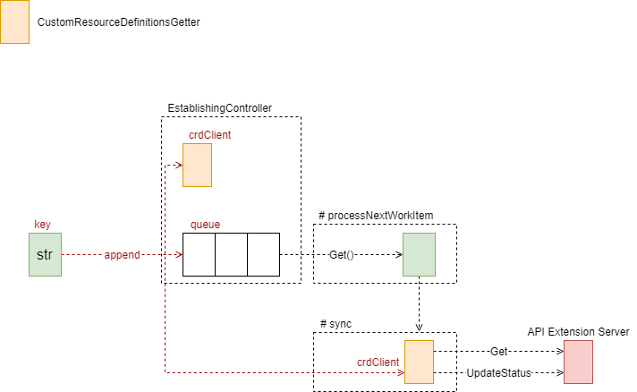

sync 代码如下

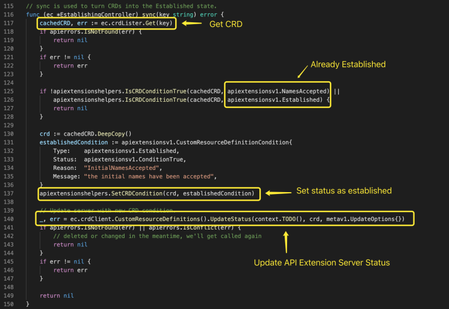

### CRD Handler

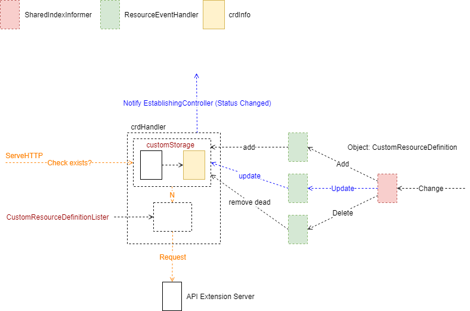

CRD Handler 向 SharedIndexInformer 注册事件处理，Watch 的对象类型 Update 时，则有可能是状态变为 Established 状态，需要向 EstablingController 发送。

CRD Handler 处理请求时，首先检查缓存是否包含请求对象，如果有，返回缓存对象；如果没有，则向 Server 请求，并更改缓存状态。 

### CRD Controller

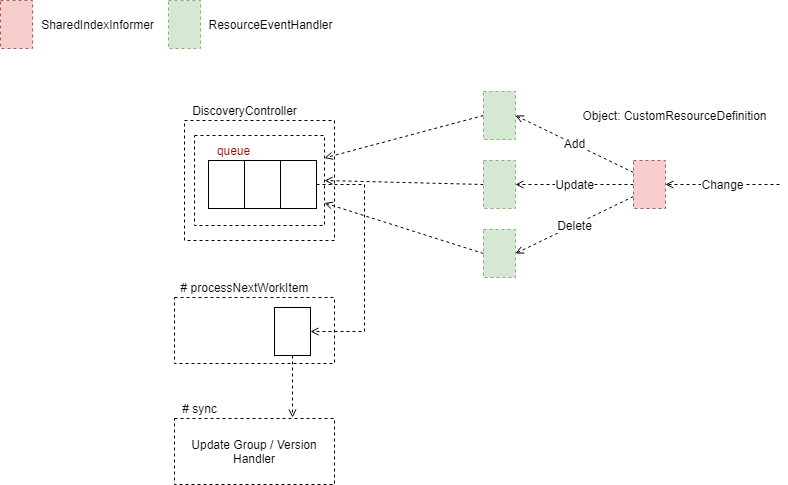

\[3\] API Server

* [API Server Routes](https://github.com/cloudnativeto/sig-kubernetes/tree/4d9236e8304d79fe1152d1ad9a21531a11af8a4f/blog/kubernetes-apiserver-route/README.md)
* [API Server API Group](https://github.com/cloudnativeto/sig-kubernetes/tree/4d9236e8304d79fe1152d1ad9a21531a11af8a4f/blog/kubernetes-apiserver-apigroup/README.md)
* [API Server Storage](https://github.com/cloudnativeto/sig-kubernetes/tree/4d9236e8304d79fe1152d1ad9a21531a11af8a4f/blog/kubernetes-apiserver-storage/README.md)
* [API Server Cacher](https://github.com/cloudnativeto/sig-kubernetes/tree/4d9236e8304d79fe1152d1ad9a21531a11af8a4f/blog/kubernetes-apiserver-cacher/README.md)
* [API Server Etcd](https://github.com/cloudnativeto/sig-kubernetes/tree/4d9236e8304d79fe1152d1ad9a21531a11af8a4f/blog/kubernetes-apiserver-etcd/README.md)
* [API Server Generic API Server](https://github.com/cloudnativeto/sig-kubernetes/tree/4d9236e8304d79fe1152d1ad9a21531a11af8a4f/blog/kubernetes-apiserver-generic-api-server/README.md)
* [API Server CustomResourceDefinitions](https://github.com/cloudnativeto/sig-kubernetes/tree/4d9236e8304d79fe1152d1ad9a21531a11af8a4f/blog/kubernetes-apiserver-crd/README.md)
* [API Server Master Server](https://github.com/cloudnativeto/sig-kubernetes/tree/4d9236e8304d79fe1152d1ad9a21531a11af8a4f/blog/kubernetes-apiserver-master-server/README.md)
* [API Server Aggregator Server](https://github.com/cloudnativeto/sig-kubernetes/tree/4d9236e8304d79fe1152d1ad9a21531a11af8a4f/blog/kubernetes-apiserver-aggregator-server/README.md)
* [API Server API Server Deprecated \(暂无\)](https://github.com/cloudnativeto/sig-kubernetes/tree/4d9236e8304d79fe1152d1ad9a21531a11af8a4f/blog/kubernetes-apiserver-route/README.md)

