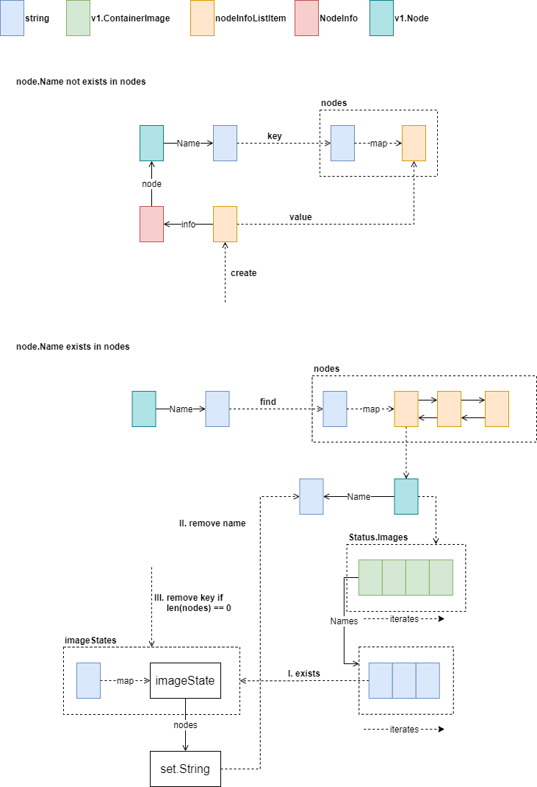
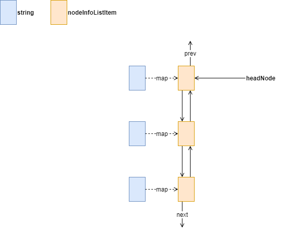
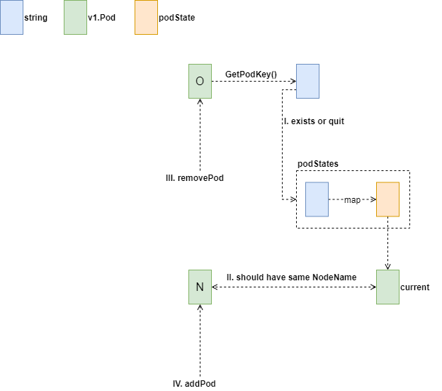
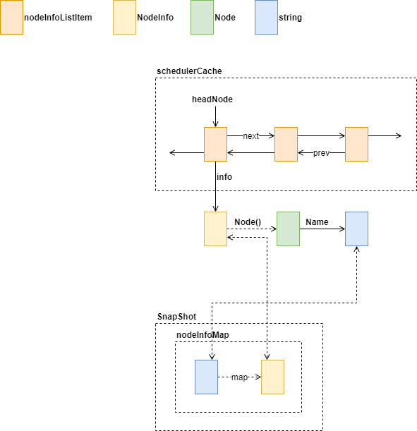

# Scheduler Cache

本文研究了 Kubernetes 中 Scheduler Cache 部分的源码，通过画图表现其设计思想，希望读者能自行配备源码进行进一步理解，学会自己进行相关设计。

## Nodes

Nodes 中保存了 Node.Name 到 nodeInfoListItem 链表的映射。每个 nodeInfoListItem 对应一个 NodeInfo 实例，实例中保存了 Node 信息及相关的 Pod 信息。

### AddNode

AddNode 方法执行时，需要传入一个 Node 实例。首先，根据 Node.Name 是否存在于 nodes 中来判断执行路径。 如果 Node.Name 不存在，那么创建一个新的 nodeInfoListItem 并存入 nodes 中。如果已经存在，那么获取对应的链表第一个对象，使用该对象包含的 Node 节点进行镜像清理，需要注意，这里并没有删除镜像，只是在 imageStates 中移除镜像名。

然后，将最近修改的 Node 对应的链表项移动至 headNode 表头，如下图所示，这样也解释了为什么一个 Node 对应的 Key 会关联一个链表。事实上，一个 Key 只有一个链表项，通过 headNode 关联起来的是最近使用顺序。

接着，将 Node 添加至 nodeTree 中，过程如下图

完成后，将 Node 中关联的镜像添加至 imageStates 中，关于 imageState 的清理操作，前面已详细说明，添加操作不再深入。

## Pod

### AddPod

 当 podStates 中对应 Pod Key 中存储的 Pod 的 NodeName 与新 Pod 的 NodeName 不一致时，会执行 removePod 操作，其代码如下

随后，再执行 addPod，这里不再描述，前面的图中已详细绘制。

### UpdatePod

## Schedule

### Update Snapshot

## Summary

本文研究了 Kubernetes 中 Scheduler Cache 部分的源码，进度在 1/5，接下来将整理 Kubernetes 1.18 版本下的全部源码设计图。 预计会有五个大模块，分别是 API Server，Client，Proxy，Controllers 和 Scheduler，和一些辅助工具如 Docker，Go Basic 和 Network 方面统共 123 张源码设计图。敬请期待吧。

