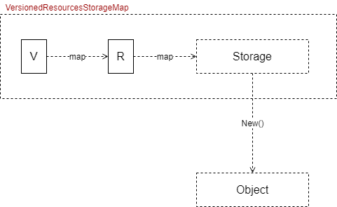
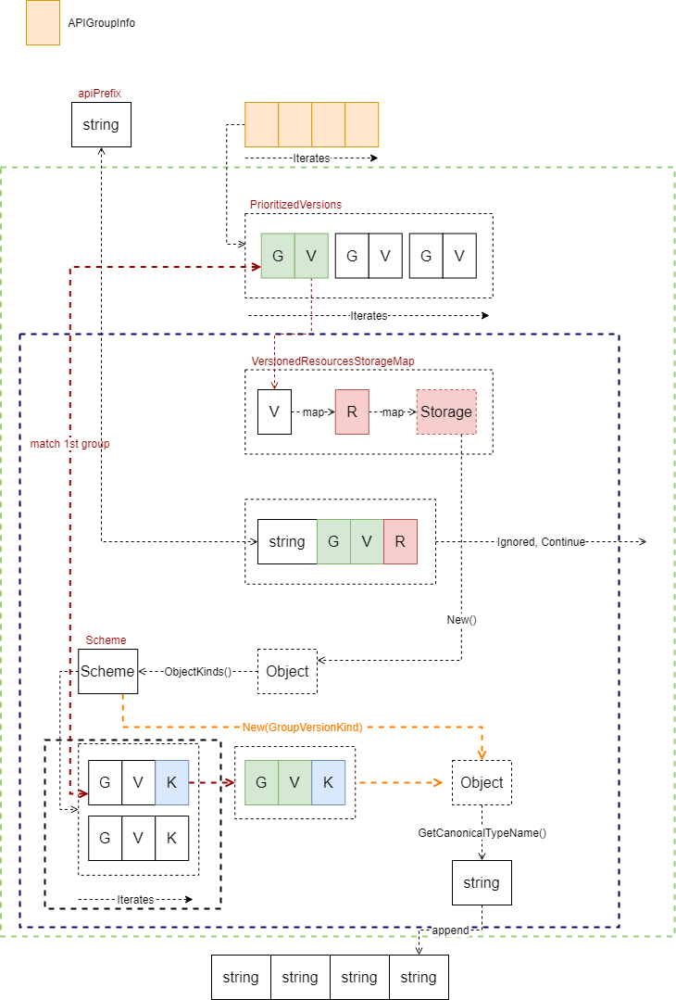
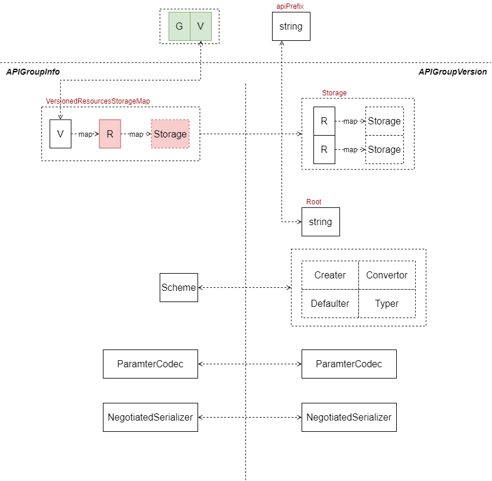
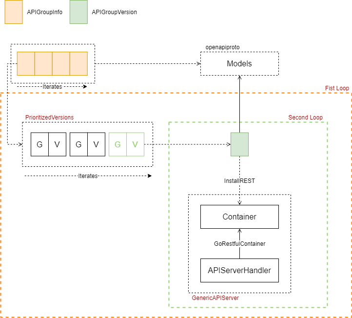
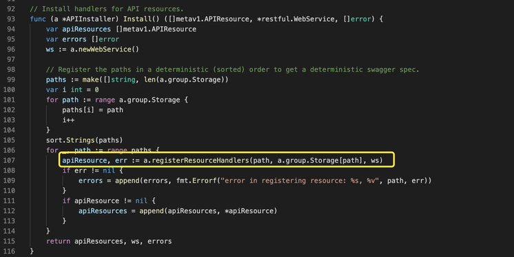
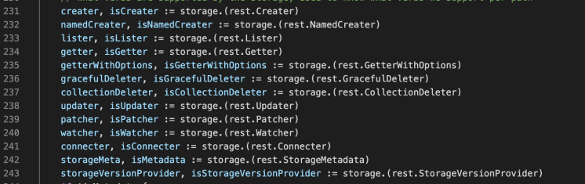
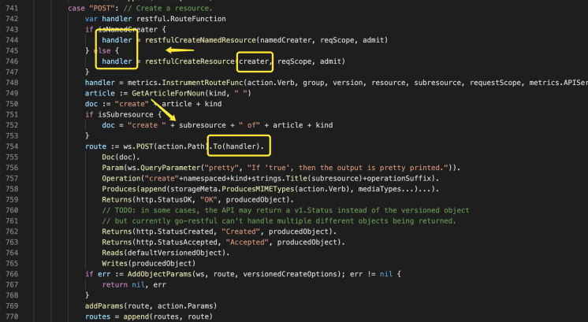
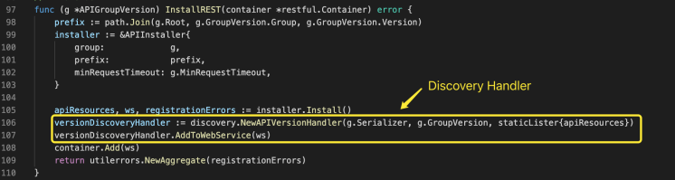

# API Server API Group

This paper studies the source code of the  **API Group** section. You should read the source code at the same time. It can enhance your design capacity.

## Resource Management

### Storage

VersionedResourcesStorageMap 保存 Version -&gt; Resource -&gt; rest.Storage 的映射，第一级映射为 Version，二级为 Resource，Storage 用于解决资源对象的创建、更改、删除等操作。

## Install on API Server

### getResourceNamesForGroup

### APIGroupVersion

### Install APIGroup

#### InstallREST

### APIInstaller

#### Install

#### registerResourceHandlers

将 rest.Storage 接口，转换为各种操作的接口，代码如下所示。从这里可以看出，rest.Storage 接口是关键，后续再深入探讨。

以 creater 为例，最终，将 creater 或 namedCreater 注册在 Post 方法上

### Discovery

在注册代码中，我们可以看到，注册 API 时，返回了可用的 Resources、restful.WebService。随后，马上将该 WebService 可获取的 Resources 注册在该 WebService 的根请求上，动作为 GET。

