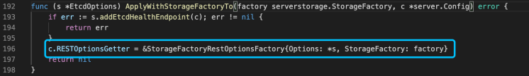
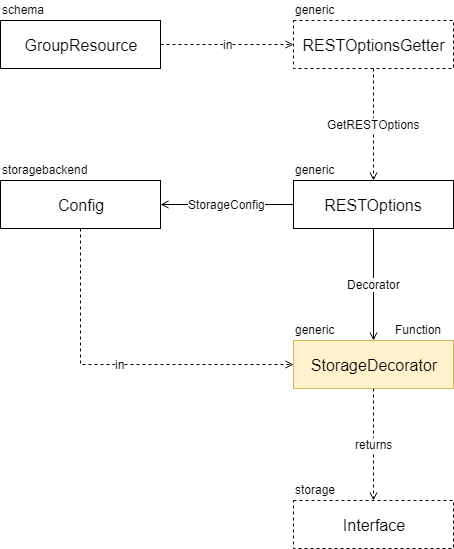
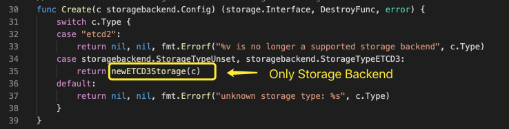

# API Server Storage

This paper studies the source code of the **Storage** section. You should read the source code at the same time. It can enhance your design capacity.

## StorageFactory

The role of StorageFactory is to encapsulate and simplify operations on resources. The main function of StorageFactory is to obtain the storage configuration Config corresponding to the resource according to the incoming GroupResource.

In the API Server, StorageFactory is generated by StorageFactoryConfig, and StorageFactoryConfig is generated by EtcdOption. After all, no matter what changes, etcd storage is the final destination.

### DefaultStorageFactory

DefaultStorageFactory is the only implementation of K8S internal StorageFactory before version 1.18. Let's analyze the mode of DefaultStorageFactory in detail.

#### Cohabitating Resources

The DefaultStorageFactory organizes the associated GroupResources together. As you can see from the above figure, each incoming GroupResource is processed in turn. Therefore, there are also priority issues among the associated GroupResources. The following figure shows the configuration of associated resources in the StorageFactory used when kube-apiserver is created.

### RESTOptionsGetter

Etcd configuration and StorageFactory are finally imported into RESTOptionsGetter. RESTOptionsGetter is used as the core configuration item to find the final storage through GroupResource.

The process of creating storage. The interface is shown in the figure below.

#### StorageFactoryRestOptionFactory

Taking StorageFactoryRestOptionFactory as an example, the steps of the GetRESTOptions method are as follows.

* Use StorageFactory to generate Storage Config.
* Create a RESTOptions structure and save the generated Storage Config.
* Use generic.UndecoratedStorage method as a decorator by default.
* If the EnableWatchCache option is turned on, the Decorator will be modified.

#### UndecoratedStorage

UndecoratedStorage only uses the passed storagebackend.Config parameter

Call factory.Create directly to create the back-end storage.

