# API Server Cacher

大家好，我是杨鼎睿，这一次给大家带来的是 API Server 的源码阅读。包括之前的 etcd 源码阅读，整个 API Server 共 109 张源码及源码图，文章最后有 API Server 系列目录。欢迎大家的阅读。

本文研究了 Cacher 部分的源码，配备源码进行进一步理解，可以加深理解,增强相关设计能力。 

## Overview

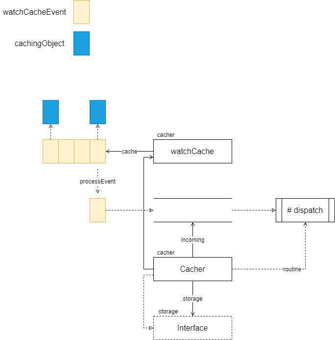

Cacher 包含了 storage.Interface 实例，这个实例是真正的存储后端实例。同时，Cacher 也实现了 storage.Interface 接口，这个是典型的**装饰器模式**。Kubernetes 源码中，有大量优雅的**设计模式**的运用，在阅读时可多加注意。简单追踪了下代码，目前猜测的关系如下所示。

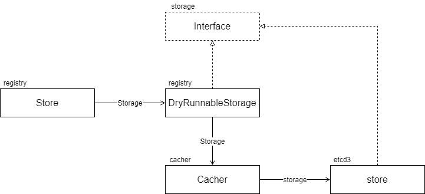

registry 包位置如下

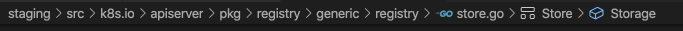

storage 位置如下

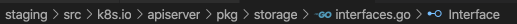

Store 初始化代码中，设置 DryRunnableStorage 位置

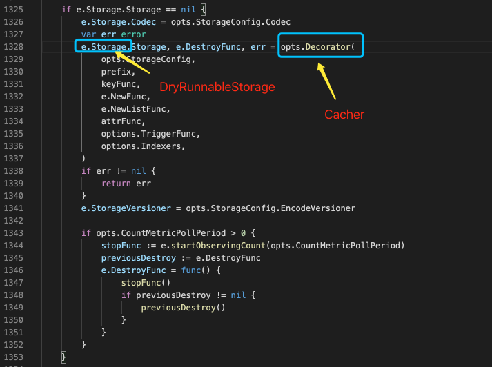

## Store

### Interface Definition

Store 接口定义在 k8s.io/client-go 中，注意接口中的 Add/Update/Delete，作用是向 Store 中添加对象。那么这个接口的作用就是：API Server 与 Etcd 间的粘合剂。

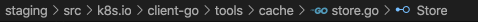

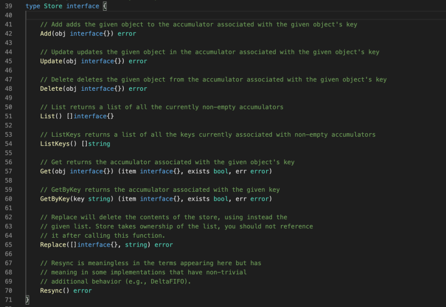

## Event Main Cycle

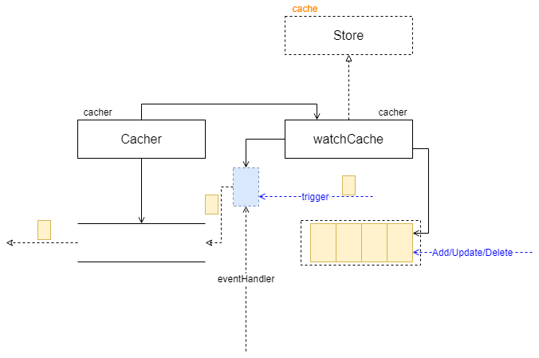

Cacher 结构定义如下，它包含了一个 watchCache 实例。

再看一下 Cacher 初始化方法，373 行用于创建 watchCache 实例，其中传入的 EventHandler 是 Cacher 的方法，这样，watchCache 就有了向 Cacher 注入事件的通道。

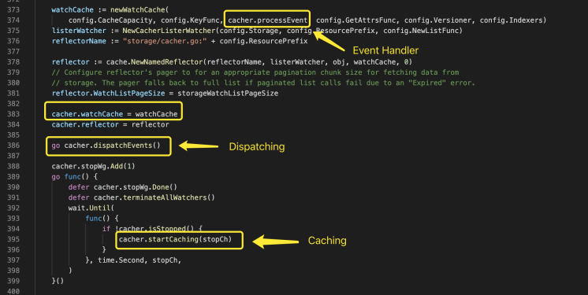

上面代码中 dispatchEvents 方法看起来是对从 watchCache 方法发送过来的 Event 进行处理的部分，我们继续，看起来我们马上就要解决事件来源问题了。

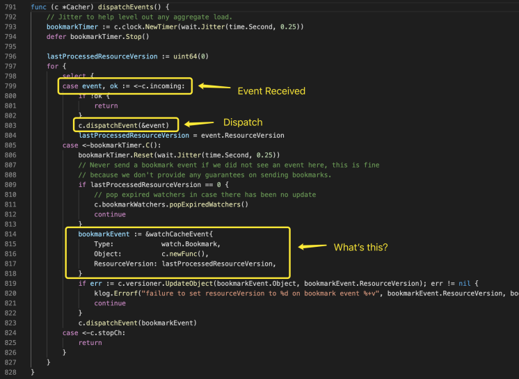

跟踪一下 incoming，那么 processEvent 是否似曾相识呢？

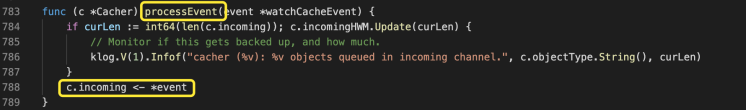

到 watchCache 结构中，找到使用 eventHandler 的位置。

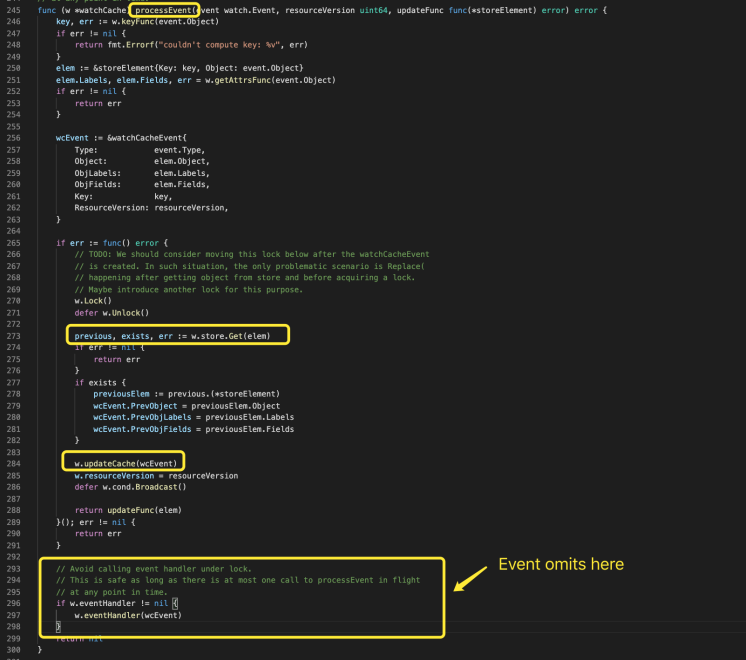

继续挖掘，至此，我们找到了事件完整来源，且**事件只有三种类型**：Add/Update/Delete。

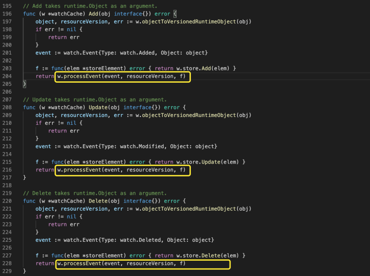

### watchCache.processEvent

原始事件到最终事件的生成如下图所示，使用的 keyFunc、getAttrsFunc、Indexer 等均通过配置传入。

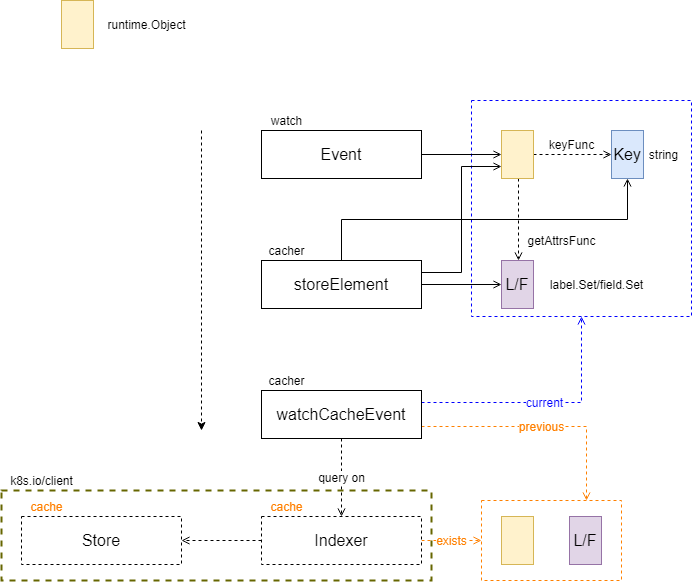

事件创建完毕后，刷新缓存

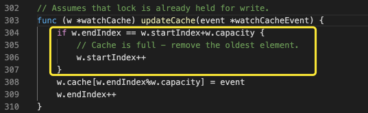

## Event Generation

### Cache Watcher

Cacher 中关于 cacheWatcher 的相关结构如下图所示

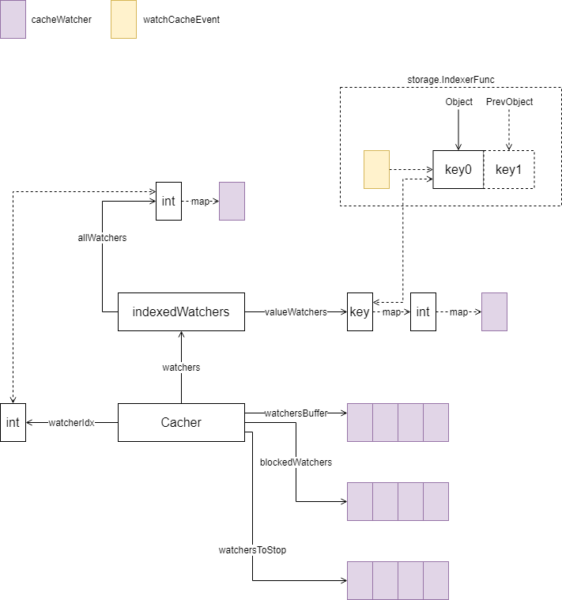

cacheWatcher 实现了 watch.Interface 接口，用于监听事件。watch.Interface 声明如下所示

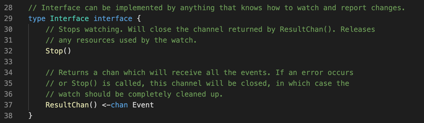

watch.Event 定义如下所示

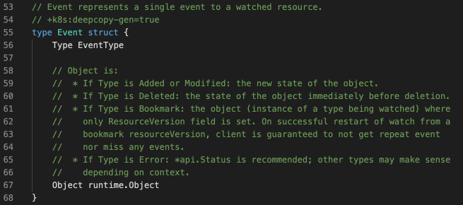

cacheWatcher 核心处理流程如下所示

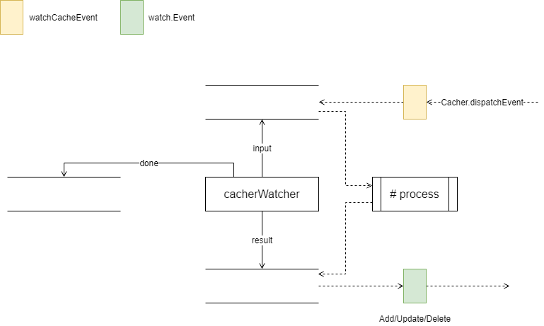

### Watch

#### Cacher

triggerValue、triggerSupported 判定过程如下

cacheWatcher 的 input channel 缓存大小计算如下

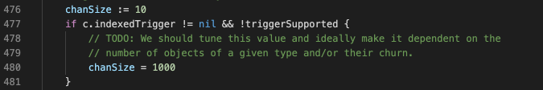

具体添加代码如下

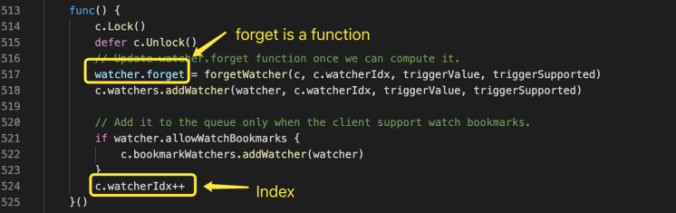

forgetWatcher 如下所示，从 Cacher 中清理 watcher。

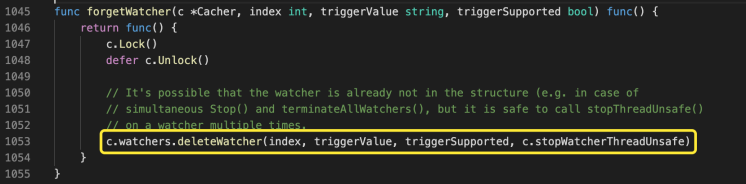

## Event Dispatching

### Bookmark Event

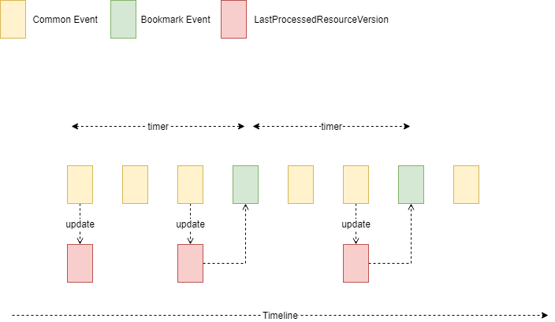

在 Cacher 事件分发过程中，创建了一个 Timer，这个 Timer 每次触发时，有可能会产生一个 Bookmark Event 事件，并分发这个事件。源码如下所示

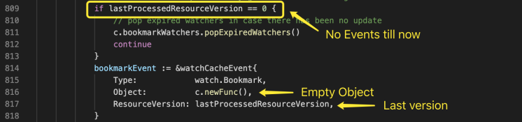

#### Dispatch

Bookmark Event 创建后，通过 Versioner 更新事件对象的 ResourceVersion 信息，然后将这个事件进行分发，接下来，我们具体看一下如何分发。

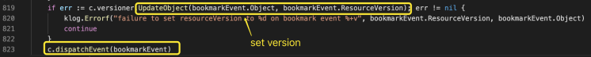

Bookmark Event 分发流程如下图所示，可以看到，事件已分发至全部 ID 小于当前时间的 cacheWatcher 中。

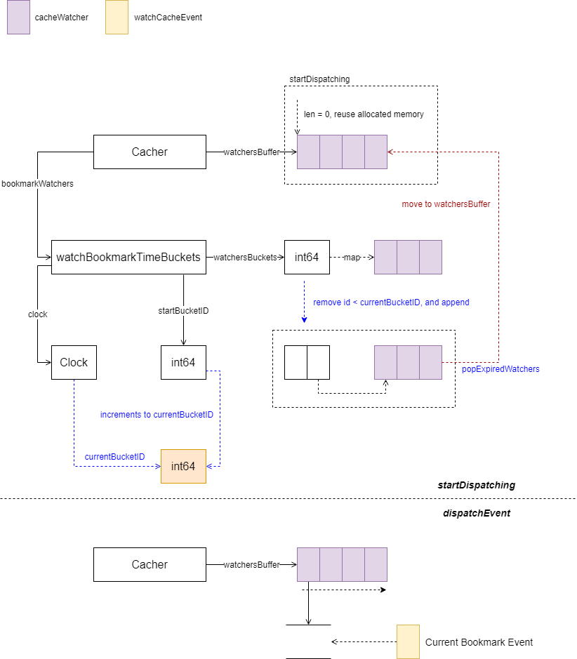

到达 cacheWatcher 后，处理非常简单，只是返回原始对象而已。

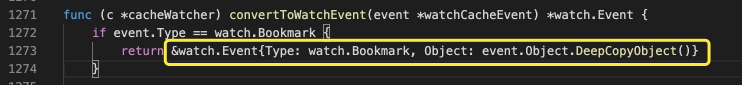

### General Event

#### Dispatch

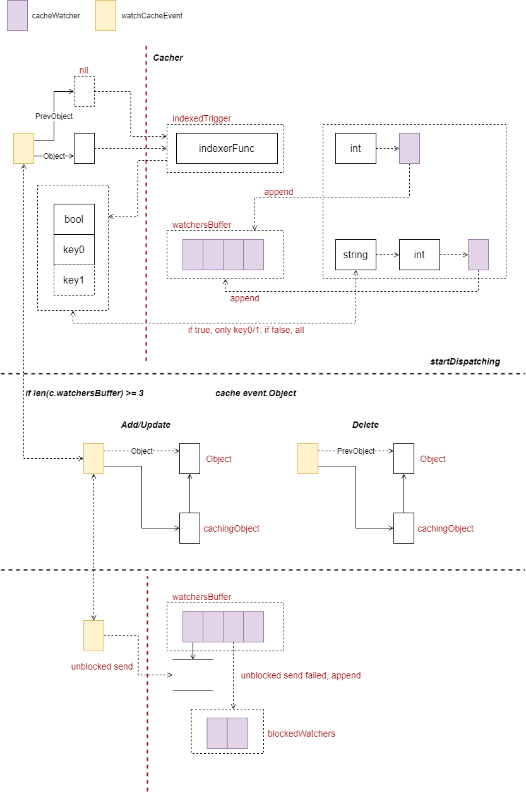

从上图可以看到，当 watchersBuffer 长度大于等于 3 时，将对象缓存起来进行发送。发送 event 时，如果有失败，则获取一个可用时间片，在这个时间片内，尝试阻塞的发送该事件。如果全部发送成功，则等待时间片消耗完毕。

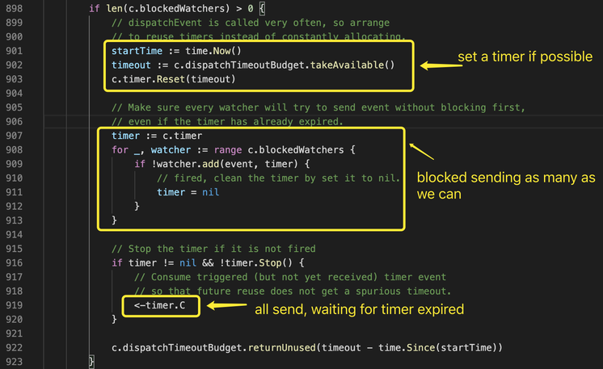

如果在时间片内发送失败，则删除剩余的 cacheWatcher

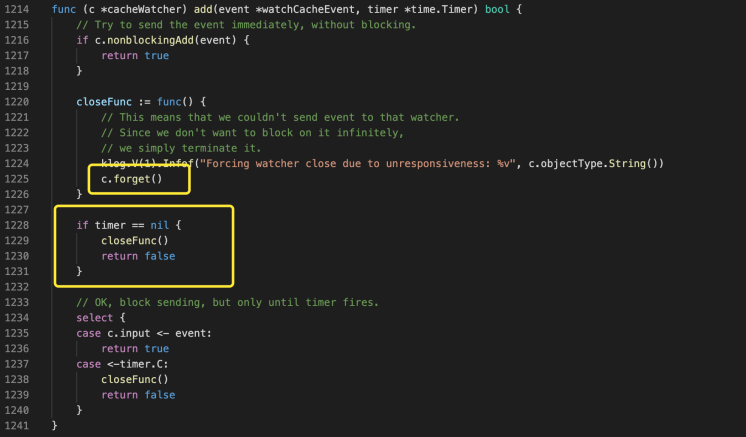

## References

* [https://kubernetes.io/docs/reference/using-api/api-concepts/](https://kubernetes.io/docs/reference/using-api/api-concepts/)

