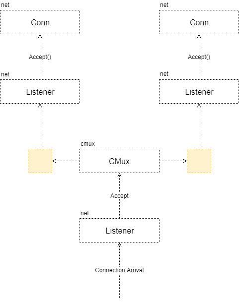
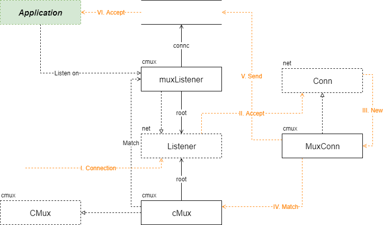
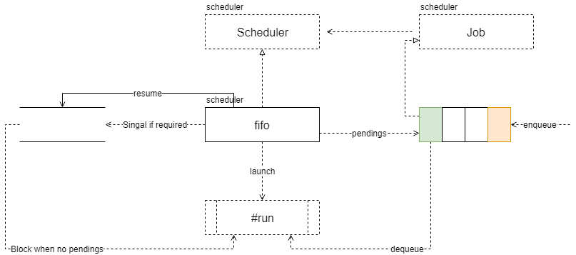
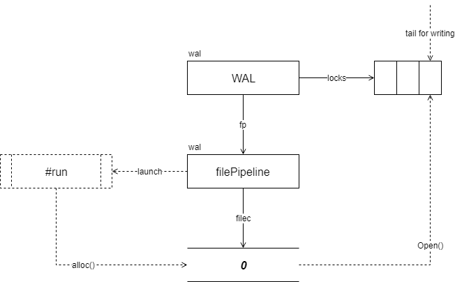

# API Server Etcd

大家好，这一次给大家带来的是 ETCD 的源码阅读。本文写就时是三部分，方便大家阅读，合成一篇，分别是 Server 篇， Storage 篇和 Utility 篇。配备源码进行进一步理解，可以加深理解,增强相关设计能力。

## Server

### Single

#### Landscape


Clients 中包含了 etcd 服务器要监听的地址，地址可为 TCP、Unix Socket 形式，且支持 http 与 https。[serverCtx](https://sourcegraph.com/github.com/etcd-io/etcd@release-3.3/-/blob/embed/serve.go#L46:6) 与一个 net.Listener 匹配，独立运行于一个 goroutine。

#### Serve Procedure


### Backend

#### Landscape


## Storage

### BoltDB Backend

#### Landscape


**run**

启动 Timer，定时提交；或者在收到停止信号时，提交并退出。代码很简单，如下所示

```go
func (b *backend) run() {
    defer close(b.donec)
    t := time.NewTimer(b.batchInterval)
    defer t.Stop()
    for {
        select {
        case <-t.C:
        case <-b.stopc:
            b.batchTx.CommitAndStop()
            return
        }
        b.batchTx.Commit()
        t.Reset(b.batchInterval)
    }
}
```

**Transaction Relationship**


**Buffer**


### MVCC

#### Store


**References**

* [ReadView](https://sourcegraph.com/github.com/etcd-io/etcd@release-3.3/-/blob/mvcc/kv.go#L35:6)
* [WriteView](https://sourcegraph.com/github.com/etcd-io/etcd@release-3.3/-/blob/mvcc/kv.go#L63:6)
* [KV](https://sourcegraph.com/github.com/etcd-io/etcd@release-3.3/-/blob/mvcc/kv.go#L100:6)

#### Watchable

**Landscape**


**Watcher Creation**


通过 watchStream 创建的全部 watcher 的 ch 全部指向了 watchStream.ch。事件走向为 watcher -&gt; watchStream。watcher 管理由 watcherGroup 负责 

**Nofity Waiter**


## Utility

### CMux

* [soheilhy/cmux](https://github.com/soheilhy/cmux): Connection multiplexer for GoLang: serve different services on the same port!

#### Landscape



#### Implementation



### Scheduler

#### Landscape



### WAL

#### Landscape



致谢一下响哥（李响）在我阅读 bboltDB 的源码的时候给予我的鼓励，使我对 ETCD 的源码产生兴趣（可惜到现在还没有见过一面）。本篇实际是在阅读 API Server 的时候完成的，本意也是为了更好的理解 API Server，API Server 部分图较多，也经历过多次重画，最近整理完毕会逐步放出，有意阅读交流的朋友请持续关注，或者催更（笑）。另外我时常会组织一起进行源码阅读并画图的活动（通常是我和我对象，本篇的 Server 部分就是她画的），如果大家有兴趣的话也可以加入进来对一些优秀设计的开源项目进行源码阅读和画图分享，表示欢迎。

