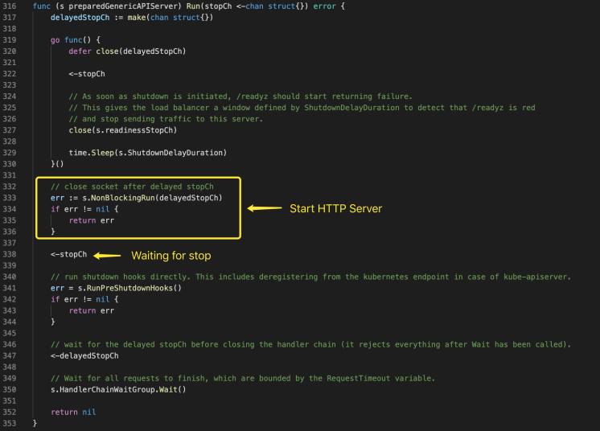

# API Server Generic API Server

本文研究了 Generic API Server 部分的源码，配备源码进行进一步理解，可以加深理解,增强相关设计能力。 

## Delegation Chain

### Overview

### Server Chain

## HTTP Server

### Handler Chain

HandlerChainBuilderFn 类型定义如下，传入一个 http.Handler 实例，并返回一个 http.Handler 实例，这样，可达到类似中间件的效果。

创建 APIServerHandler 时，使用的是下面的方法

### Start

最终生成的 preparedAPIAggregator 的启动代码如下，只是简单的调用了 runnable 的 Run 方法，在 Server Chain 中，我们知道，runnable 是 APIAggregator 包含的 GenericAPIServer 生成的 preparedGenericAPIServer 实例。

preparedGenericAPIServer 的 Run 方法如下所示

