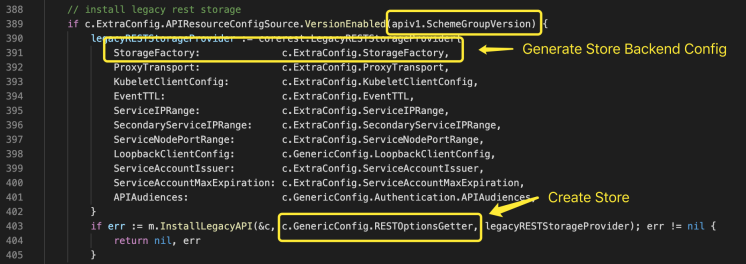

# API Server Master Server

This article has studied the source code of the Master Server part, equipped with the source code for further understanding, which can deepen the understanding and enhance related design capabilities.

## Server Handler

### Serve HTTP Procedure

### Add Route

## Resource Handler

### Install Legacy Resource

First, determine whether the resource configuration of the v1 version is enabled. If enabled, the corresponding resource processing API will be installed. Note that the two core components, StorageFactory and RESTOptionsGetter, have been explained in more detail before.

Create a LegacyRESTStorageProvider object, save the StorageFactory and other necessary information, and then pass in the method InstallLegacyAPI, along with RESTOptionsGetter.

InstallLegacyAPI uses the passed parameters to create APIGroupInfo and install it.

#### NewLegacyRESTStorage

* Create APIGroupInfo.

* Create various types of RESTStorage, not all of them are listed in the figure below.

* Build resources for Storage mapping.

* An associate resource to Storage mapping on version v1.

#### REST

Each resource type has its own REST package. Generally speaking, REST only needs to simply encapsulate a Store. When creating, it will register **NewFunc**, **NewListFunc**, and **behavior strategies** that match the resource type.

Note that REST is not necessarily only one Store, such as Posstorage.

### RESTStorageProvider

RESTStorageProvider cooperates with Resource Config and REST Options to create APIGroupInfo, which is used to register resource processing methods with API Server.

RESTOptionsGetter registers the Store with the Storage Map according to the version and resource check method in APIResourceConfigSource, and finally mounts the Storage Map to APIGroupInfo. Take Auto Scaling as an example, the code is as follows.

The code to create the v1 version of Storage is as follows, and the other parts are similar.

It is not difficult to see that RESTStorageProvider is the core component that undertakes configuration to API Group. Such a design can clearly divide the boundaries of each structure and interface, and set a reasonable process.

## Cluster Authentication

### Controller Runner

The Listener has only one Enqueue method and is registered somewhere through Notifier. ControllerRunner controls the execution of a task. If it is necessary to notify the outside during the execution process, it will broadcast \(or unicast\) to the target task queue through the registered Listener list. The queue owner may be a task waiting for the queue to output.

Through this design, use the queue feature to isolate the two related tasks and divide their boundaries. The Enqueue method of the Listener interface has no parameters. Therefore, the implementation of the Listener focuses more on the occurrence of the event rather than the specific details of the event content. This idea is worth learning.

### Dynamic CA

* PKI certificate and requirements

