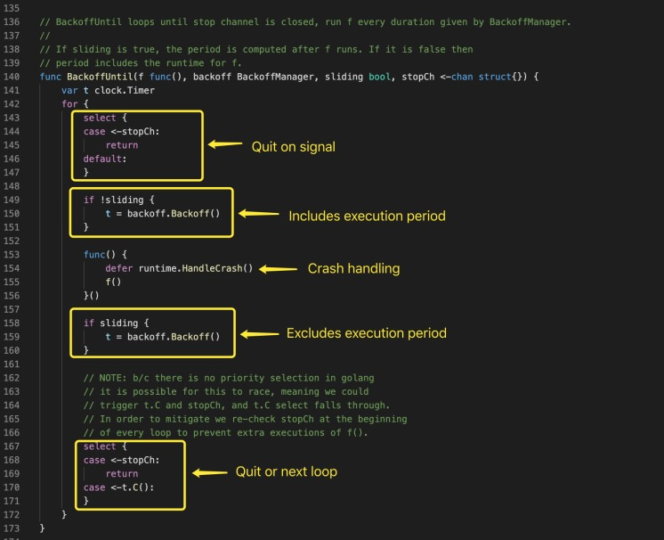
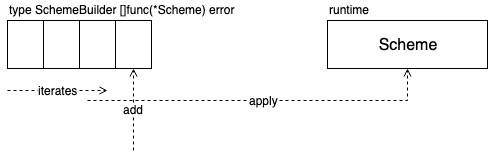
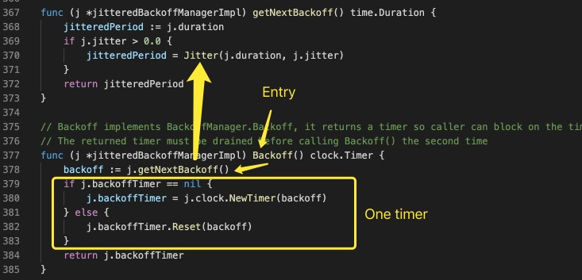
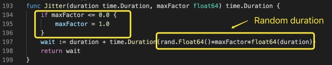

# Common Tools Go Routine Tools

## Parallelize

## Stop Channel Mode

### Group

Group 增强了 Go 标准库中 sync.Group 的能力。用于执行通过 Context 或 channel 来控制终止条件的方法，并将该方法在一个独立 Go Routine 中执行。  
 

### Forever & Until

### JitterUntil

从代码的注释看，我们需要解决两个关键问题，sliding 如何起作用，jitterFactor 如何起作用，解决了这两个问题，一切就清晰了。  
 

#### Sliding

从代码中，不难看出，所谓 sliding，就是时间间隔是否包含_**执行时间**_。按 170 行的代码，并不难猜出，Backoff\(\) 返回的是一个 Timer 类型，那么该 Timer 启动时间即关键。  
这个代码需要注意一个细节：从 167 行开始的 select 并不能保证顺序，换句话说，如果 timer 已经触发且 stopCh 已经关闭时，未必能保证一定退出。但进入下轮循环后，由于第 144 行代码，一定能确保程序正常退出。  
 

#### JitterFactor

jitterFactor 是依赖于 BackoffManager 起作用的，先看一下创建过程，简单的保留了配置参数及其他关联对象。  

  
再看其 Backoff 方法的实现，注意 379 ～ 383 行，确保只有一个 Timer 在工作。  

继续看 Jitter 实现，在固定的 duration 上添加了一个动态值，至此，两个问题都解决了。  

