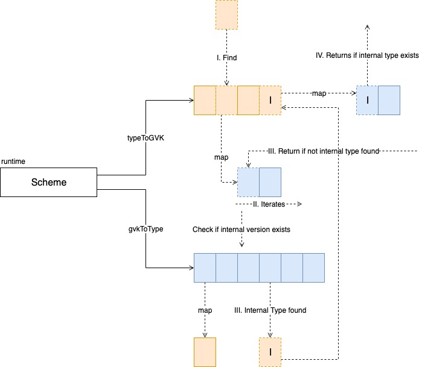
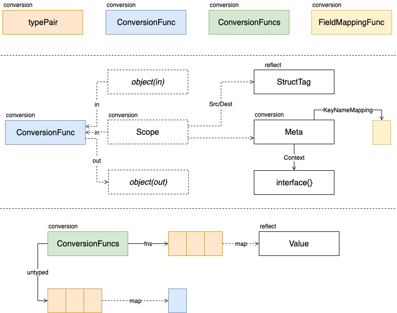
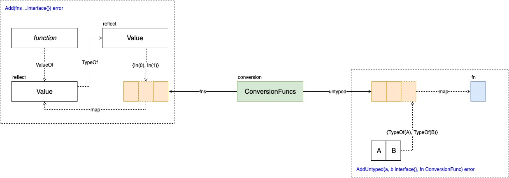
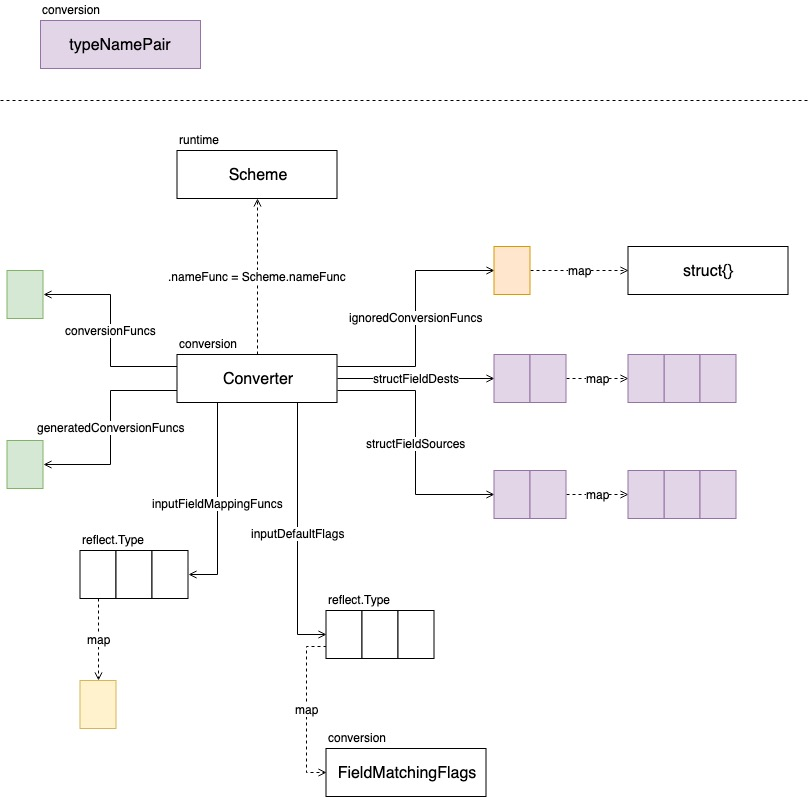
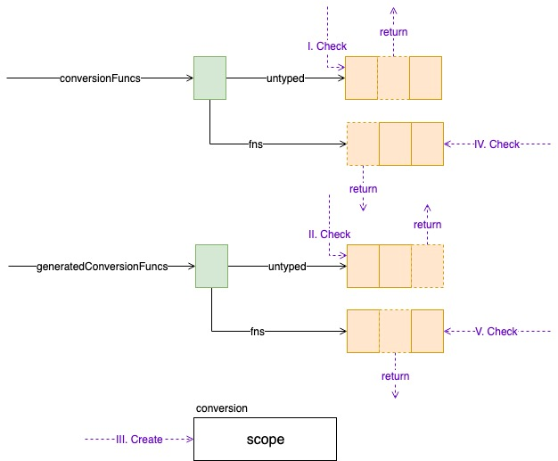
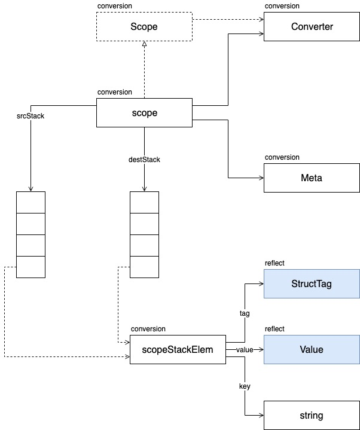

# Core The Basics

## Object

### Overview


  
Object 实例如下所示，基本都在 pkg/apis 目录下，自己查找即可。  


### Unstructured


  
Unstructured 与 Object 配合使用的场景如下  


  
实例图如下  


  


## Scheme

### Builder


### Scheme

看一下 [Scheme](https://sourcegraph.com/github.com/kubernetes/apimachinery@release-1.15/-/blob/pkg/runtime/scheme.go#L47) 的定义，前四项都是在维护 reflect.Type 与 schema.GroupVersionKind 的关系。defaulterFuncs 用于构建默认对象。

```go
type Scheme struct {
    // versionMap allows one to figure out the go type of an object with
    // the given version and name.
    gvkToType map[schema.GroupVersionKind]reflect.Type

    // typeToGroupVersion allows one to find metadata for a given go object.
    // The reflect.Type we index by should *not* be a pointer.
    typeToGVK map[reflect.Type][]schema.GroupVersionKind

    // unversionedTypes are transformed without conversion in ConvertToVersion.
    unversionedTypes map[reflect.Type]schema.GroupVersionKind

    // unversionedKinds are the names of kinds that can be created in the context of any group
    // or version
    // TODO: resolve the status of unversioned types.
    unversionedKinds map[string]reflect.Type

    // Map from version and resource to the corresponding func to convert
    // resource field labels in that version to internal version.
    fieldLabelConversionFuncs map[schema.GroupVersionKind]FieldLabelConversionFunc

    // defaulterFuncs is an array of interfaces to be called with an object to provide defaulting
    // the provided object must be a pointer.
    defaulterFuncs map[reflect.Type]func(interface{})

    // converter stores all registered conversion functions. It also has
    // default converting behavior.
    converter *conversion.Converter

    // versionPriority is a map of groups to ordered lists of versions for those groups indicating the
    // default priorities of these versions as registered in the scheme
    versionPriority map[string][]string

    // observedVersions keeps track of the order we've seen versions during type registration
    observedVersions []schema.GroupVersion

    // schemeName is the name of this scheme.  If you don't specify a name, the stack of the NewScheme caller will be used.
    // This is useful for error reporting to indicate the origin of the scheme.
    schemeName string
}
```

  
[FieldLabelConversionFunc](https://sourcegraph.com/github.com/kubernetes/apimachinery@release-1.15/-/blob/pkg/runtime/scheme.go#L89:86) 用于将 label、value 转换为内部 label、value。

```go
type FieldLabelConversionFunc func(label, value string) (internalLabel, internalValue string, err error)
```

### AddKnownTypes

[AddKnownTypes](https://sourcegraph.com/github.com/kubernetes/apimachinery@release-1.15/-/blob/pkg/runtime/scheme.go#L172) 只需要注意一个问题，即从传入的 GroupVersion 通过 reflect.Type 的 Name 方法返回值作为 Kind 生成 GroupVersionKind，请看简化后的示例 [Reflect Name Sample](https://gist.github.com/fengyfei/46fe53e3a4ef3eb05cf4402cefabae07)，示例代码可在 [Go Playground](https://play.golang.org/) 下执行。  
   


  


### AddUnversionedTypes

[AddUnversionedTypes](https://sourcegraph.com/github.com/kubernetes/apimachinery@release-1.15/-/blob/pkg/runtime/scheme.go#L154) 原理如下。可以将 Unversioned Type 理解为一个 Object 挂载在一个 Group 上，且 Version 永不更新。  
   


  


### nameFunc

[nameFunc](https://sourcegraph.com/github.com/kubernetes/apimachinery@release-1.15/-/blob/pkg/runtime/scheme.go#L116) 原理如下，只要注意返回类型优先为 Internal Type 就可以了。  
   





### Others

* [AddTypeDefaultingFunc](https://sourcegraph.com/github.com/kubernetes/apimachinery@1799e75a07195de9460b8ef7300883499f12127b/-/blob/pkg/runtime/scheme.go#L384)
* [Default](https://sourcegraph.com/github.com/kubernetes/apimachinery@1799e75a07195de9460b8ef7300883499f12127b/-/blob/pkg/runtime/scheme.go#L389)
* [ConvertFieldLabel](https://sourcegraph.com/github.com/kubernetes/apimachinery@1799e75a07195de9460b8ef7300883499f12127b/-/blob/pkg/runtime/scheme.go#L472)
* [SetVersionPriority](https://sourcegraph.com/github.com/kubernetes/apimachinery@1799e75a07195de9460b8ef7300883499f12127b/-/blob/pkg/runtime/scheme.go#L620)
* [Name](https://sourcegraph.com/github.com/kubernetes/apimachinery@1799e75a07195de9460b8ef7300883499f12127b/-/blob/pkg/runtime/scheme.go#L748)

## Conversion

### Landscape



  
   
[typePair](https://sourcegraph.com/github.com/kubernetes/apimachinery@release-1.15/-/blob/pkg/conversion/converter.go#L24) 用来表示源类型与目标类型的组合；[typeNamePair](https://sourcegraph.com/github.com/kubernetes/apimachinery@release-1.15/-/blob/pkg/conversion/converter.go#L29) 存储类型及类型名称；[DefaultNameFunc](https://sourcegraph.com/github.com/kubernetes/apimachinery@release-1.15/-/blob/pkg/conversion/converter.go#L41) 用做默认的类型到 Name 的转换方法。[ConversionFunc](https://sourcegraph.com/github.com/kubernetes/apimachinery@release-1.15/-/blob/pkg/conversion/converter.go#L47:57) 定义了对象转换方法。  


#### Core Function Definitions

DefaultNameFunc 实现如下所示

```go
var DefaultNameFunc = func(t reflect.Type) string { return t.Name() }
```

  
ConversionFunc 声明如下所示

```go
type ConversionFunc func(a, b interface{}, scope Scope) error
```

  
FieldMappingFunc 将 key 转换为源结构及目标结构中的 Field

```go
type FieldMappingFunc func(key string, sourceTag, destTag reflect.StructTag) (source string, dest string)
```

#### ConversionFuncs



### Converter



  
   
将下列方法做简要说明：

* [RegisterConvesionFunc](https://sourcegraph.com/github.com/kubernetes/apimachinery@release-1.15/-/blob/pkg/conversion/converter.go#L375) 直接调用 ConversionFuncs.Add 方法
* [RegisterUntypedConversionFunc](https://sourcegraph.com/github.com/kubernetes/apimachinery@release-1.15/-/blob/pkg/conversion/converter.go#L389) 则调用 ConversionFuncs.AddUntyped 方
* [RegisterIgnoredConversion](https://sourcegraph.com/github.com/kubernetes/apimachinery@release-1.15/-/blob/pkg/conversion/converter.go#L402) 将不做转换的类型记录在映射中
* [RegisterInputDefaults](https://sourcegraph.com/github.com/kubernetes/apimachinery@release-1.15/-/blob/pkg/conversion/converter.go#L419) 注册输入类型的 Field 转换方法

#### doConversion

Converter 在执行对象转换方法时，如 [Convert](https://sourcegraph.com/github.com/kubernetes/apimachinery@release-1.15/-/blob/pkg/conversion/converter.go#L469)、[DefaultConvert](https://sourcegraph.com/github.com/kubernetes/apimachinery@release-1.15/-/blob/pkg/conversion/converter.go#L481) 允许传入一个 Meta 对象，并执行 [doConversion](https://sourcegraph.com/github.com/kubernetes/apimachinery@release-1.15/-/blob/pkg/conversion/converter.go#L487) 方法，在这个方法中构建 scope 对象。  




  


#### Scope



#### defaultConvert

[defaultConvert](https://sourcegraph.com/github.com/kubernetes/apimachinery@release-1.15/-/blob/pkg/conversion/converter.go#L582) 处理默认的类型变换，传入的 sv, dv 已经经由 [EnforcePtr](https://sourcegraph.com/github.com/kubernetes/apimachinery@release-1.15/-/blob/pkg/conversion/helper.go#L27:6) 确保为可寻址。这部分代码是对 Go 中 reflect 包近乎完美的应用。  
首先，处理基本类型的转换，即可通过 [AssignableTo](https://golang.org/pkg/reflect/#pkg-index) 或 [ConvertibleTo](https://golang.org/pkg/reflect/#pkg-index) 转换的类型。

```go
switch st.Kind() {
    case reflect.Map, reflect.Ptr, reflect.Slice, reflect.Interface, reflect.Struct:
    // 这些类型后续处理
    default:
    // This should handle all simple types.
    if st.AssignableTo(dt) {
        dv.Set(sv)
        return nil
    }
    if st.ConvertibleTo(dt) {
        dv.Set(sv.Convert(dt))
        return nil
    }
}
```

  
然后根据 dv.Kind\(\) 分别进行处理。  


**dv.Kind\(\) -&gt; reflect.Struct**

直接返回 [convertKV](https://sourcegraph.com/github.com/kubernetes/apimachinery@release-1.15/-/blob/pkg/conversion/converter.go#L788) 方法的结果，但是，需要注意，首先将 sv、dv 分别转化为 Key/Value 的形式。[toKVValue](https://sourcegraph.com/github.com/kubernetes/apimachinery@release-1.15/-/blob/pkg/conversion/converter.go#L691) 方法请自行研究。

```go
return c.convertKV(toKVValue(sv), toKVValue(dv), scope)
```

**dv.Kind\(\) -&gt; reflect.Slice**

```go
case reflect.Slice:
    if sv.IsNil() {
        // Don't make a zero-length slice.
        dv.Set(reflect.Zero(dt))
        return nil
    }
    dv.Set(reflect.MakeSlice(dt, sv.Len(), sv.Cap()))
    for i := 0; i < sv.Len(); i++ {
        scope.setIndices(i, i)
        if err := c.convert(sv.Index(i), dv.Index(i), scope); err != nil {
            return err
        }
    }
```

**dv.Kind\(\) -&gt; reflect.Ptr**

```go
case reflect.Ptr:
    if sv.IsNil() {
        // Don't copy a nil ptr!
        dv.Set(reflect.Zero(dt))
        return nil
    }
    dv.Set(reflect.New(dt.Elem()))
    switch st.Kind() {
        case reflect.Ptr, reflect.Interface:
        return c.convert(sv.Elem(), dv.Elem(), scope)
        default:
        return c.convert(sv, dv.Elem(), scope)
    }
```

**dv.Kind\(\) -&gt; reflect.Interface**

```go
case reflect.Interface:
    if sv.IsNil() {
        // Don't copy a nil interface!
        dv.Set(reflect.Zero(dt))
        return nil
    }
    tmpdv := reflect.New(sv.Elem().Type()).Elem()
    if err := c.convert(sv.Elem(), tmpdv, scope); err != nil {
        return err
    }
    dv.Set(reflect.ValueOf(tmpdv.Interface()))
    return nil
```

**dv.Kind\(\) -&gt; reflect.Map**

```go
case reflect.Map:
    if sv.IsNil() {
        // Don't copy a nil ptr!
        dv.Set(reflect.Zero(dt))
        return nil
    }
    dv.Set(reflect.MakeMap(dt))
    for _, sk := range sv.MapKeys() {
        dk := reflect.New(dt.Key()).Elem()
        if err := c.convert(sk, dk, scope); err != nil {
            return err
        }
        dkv := reflect.New(dt.Elem()).Elem()
        scope.setKeys(sk.Interface(), dk.Interface())

        if err := c.convert(sv.MapIndex(sk), dkv, scope); err != nil {
            return err
        }
        dv.SetMapIndex(dk, dkv)
    }
```

