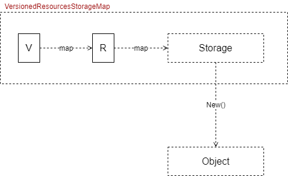
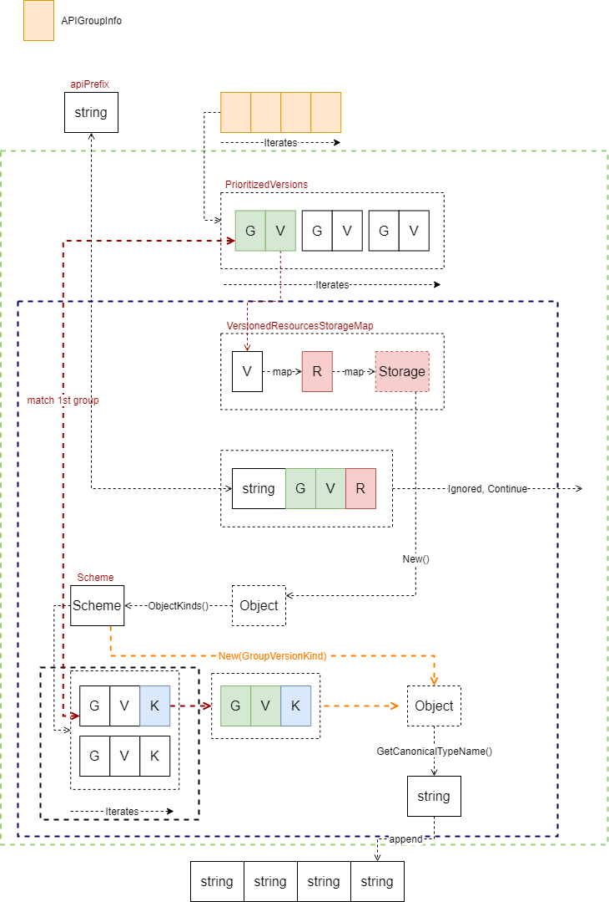
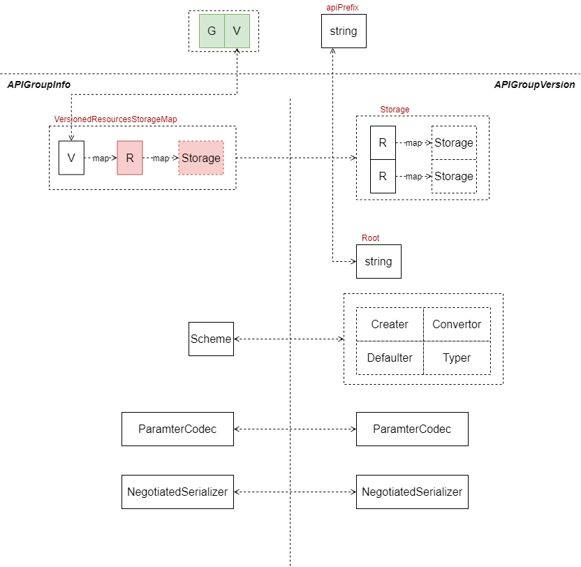
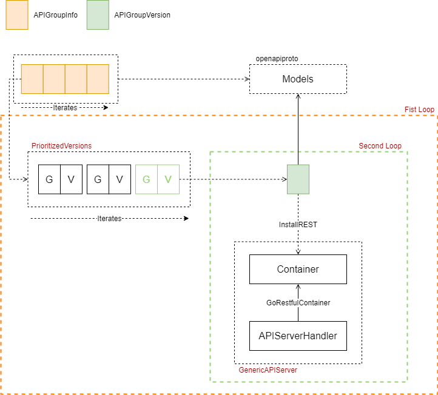
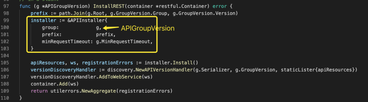
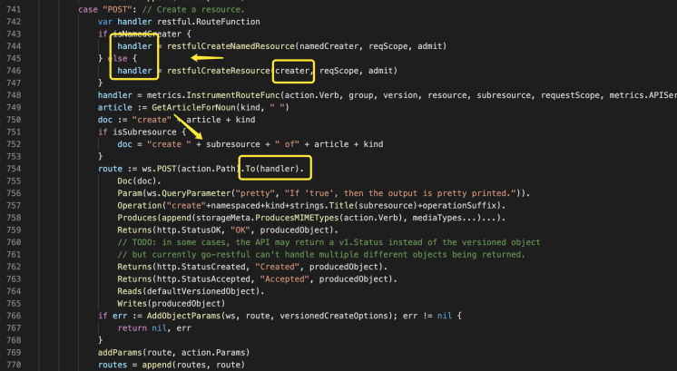
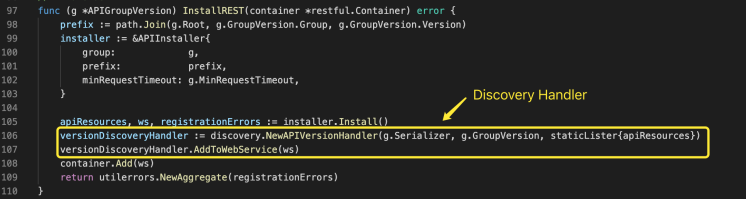

大家好，我是杨鼎睿，这一次给大家带来的是 API Server 的源码阅读。包括之前的 etcd 源码阅读，整个 API Server 共 109 张源码及源码图，文章最后有 API Server 系列目录。欢迎大家的阅读。

本文研究了 API Group 部分的源码，配备源码进行进一步理解，可以加深理解,增强相关设计能力。

## Resource Management

### Storage
VersionedResourcesStorageMap 保存 Version -> Resource -> rest.Storage 的映射，第一级映射为 Version，二级为 Resource，Storage 用于解决资源对象的创建、更改、删除等操作。

## Install on API Server

### getResourceNamesForGroup

### APIGroupVersion

### Install APIGroup

#### InstallREST

### APIInstaller

#### Install

#### registerResourceHandlers
将 rest.Storage 接口，转换为各种操作的接口，代码如下所示。从这里可以看出，rest.Storage 接口是关键，后续再深入探讨。

以 creater 为例，最终，将 creater 或 namedCreater 注册在 Post 方法上

### Discovery
在注册代码中，我们可以看到，注册 API 时，返回了可用的 Resources、restful.WebService。随后，马上将该 WebService 可获取的 Resources 注册在该 WebService 的根请求上，动作为 GET。

