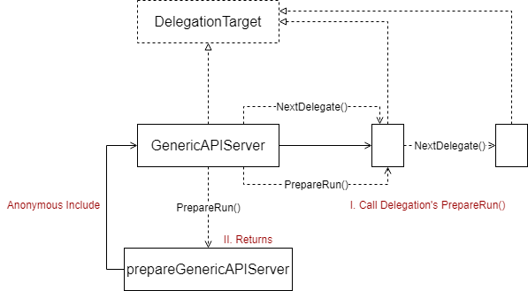
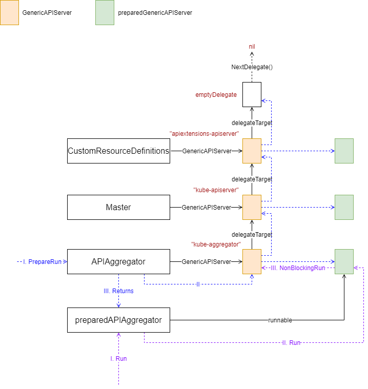
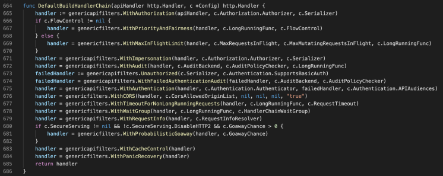
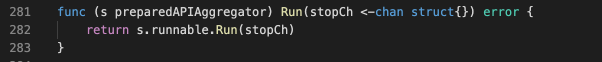

大家好，我是杨鼎睿，这一次给大家带来的是 API Server 的源码阅读。包括之前的 etcd 源码阅读，整个 API Server 共 109 张源码及源码图，文章最后有 API Server 系列目录。欢迎大家的阅读。

本文研究了 Generic API Server 部分的源码，配备源码进行进一步理解，可以加深理解,增强相关设计能力。

## Delegation Chain

### Overview

### Server Chain

## HTTP Server

### Handler Chain
HandlerChainBuilderFn 类型定义如下，传入一个 http.Handler 实例，并返回一个 http.Handler 实例，这样，可达到类似中间件的效果。

创建 APIServerHandler 时，使用的是下面的方法

### Start
最终生成的 preparedAPIAggregator 的启动代码如下，只是简单的调用了 runnable 的 Run 方法，在 Server Chain 中，我们知道，runnable 是 APIAggregator 包含的 GenericAPIServer 生成的 preparedGenericAPIServer 实例。

preparedGenericAPIServer 的 Run 方法如下所示

[3] API Server
- [API Server Routes](/blog/kubernetes-apiserver-route/)
- [API Server API Group](/blog/kubernetes-apiserver-apigroup/)
- [API Server Storage](/blog/kubernetes-apiserver-storage/)
- [API Server Cacher](/blog/kubernetes-apiserver-cacher/)
- [API Server Etcd](/blog/kubernetes-apiserver-etcd/)
- [API Server Generic API Server](/blog/kubernetes-apiserver-generic-api-server/)
- [API Server CustomResourceDefinitions](/blog/kubernetes-apiserver-crd/)
- [API Server Master Server](/blog/kubernetes-apiserver-master-server/)
- [API Server Aggregator Server](/blog/kubernetes-apiserver-aggregator-server/)
- [API Server API Server Deprecated (暂无)](/blog/kubernetes-apiserver-route/)