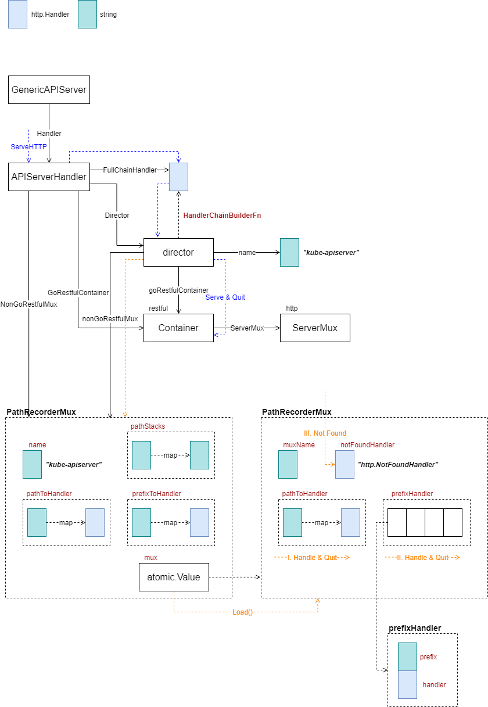
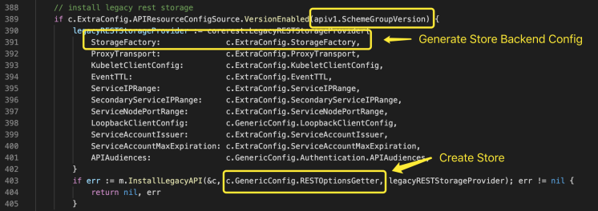
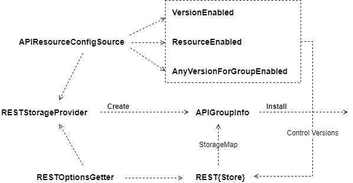
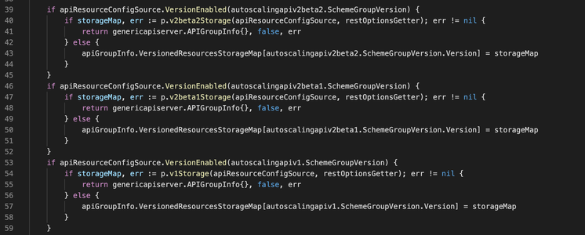
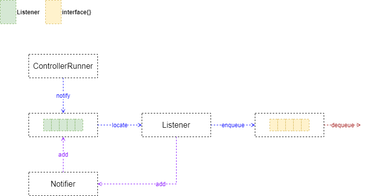
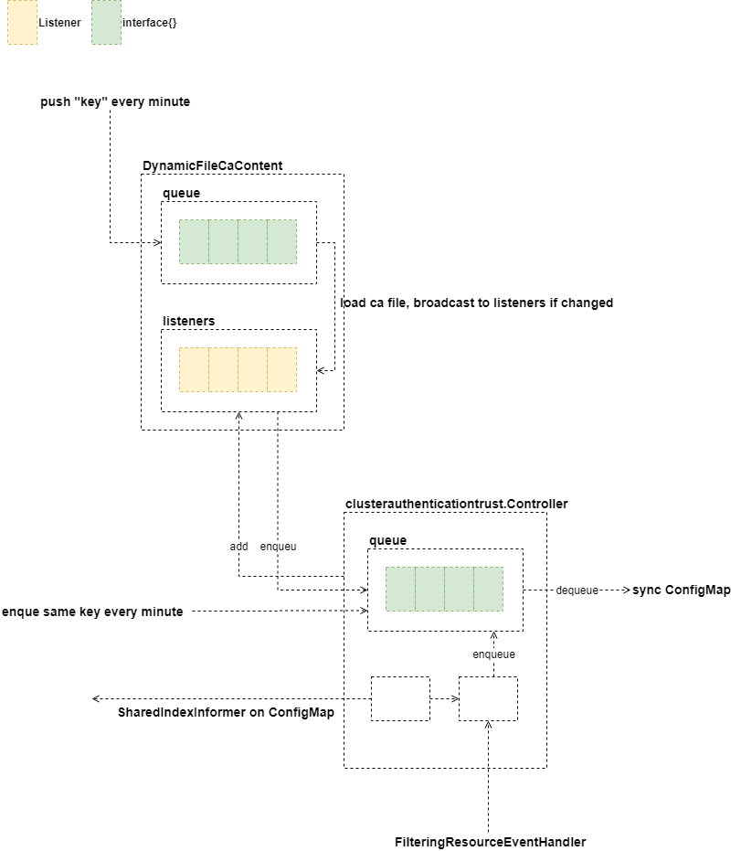

大家好，我是杨鼎睿，这一次给大家带来的是 API Server 的源码阅读。包括之前的 etcd 源码阅读，整个 API Server 共 109 张源码及源码图，文章最后有 API Server 系列目录。欢迎大家的阅读。

本文研究了 Master Server 部分的源码，配备源码进行进一步理解，可以加深理解,增强相关设计能力。

## Server Handler

### Serve HTTP Procedure

### Add Route

## Resource Handler

### Install Legacy Resource
首先，判断是否开启了 v1 版本的资源配置，如果开启，才会安装对应的资源处理 API。注意两个核心组件 StorageFactory 与 RESTOptionsGetter，此前都有较为详细的说明。

创建 LegacyRESTStorageProvider 对象，保存 StorageFactory 及其他必要的信息，然后传入方法 InstallLegacyAPI，伴随传入的还有 RESTOptionsGetter。

InstallLegacyAPI 使用传入的参数，创建 APIGroupInfo，并安装。

#### NewLegacyRESTStorage

- 创建 APIGroupInfo

- 创建各种类型的 RESTStorage，下图没有列举全部

- 构建资源到 Storage 的映射

- 将资源到 Storage 的映射，关联在版本 v1 上

#### REST
每个资源类型，都有自己的 REST 封装。一般说来，REST 只需要简单的封装一个 Store 即可。创建时，将注册与该资源类型匹配的 **NewFunc**、**NewListFunc** 以及**行为策略**。

要注意，REST 里未必只包含一个 Store，比如 PosStorage

### RESTStorageProvider

RESTStorageProvider 配合 Resource Config 与 REST Options 创建 APIGroupInfo，用于向 API Server 注册资源处理方法。

RESTOptionsGetter 根据 APIResourceConfigSource 中的版本、资源检查方法，向 Storage Map 注册 Store，并最终将 Storage Map 挂载到 APIGroupInfo 上。以 Auto Scaling 为例，代码如下所示

创建 v1 版本的 Storage 的代码如下，其他部分大同小异。

不难看出，RESTStorageProvider 是承接配置到 API Group 的核心组件。这样的设计，可以非常明确的划分各个结构、接口的边界，并设定了合理的流程。

## Cluster Authentication

### Controller Runner

Listener 只有一个 Enqueue 方法，并通过 Notifier 注册到某处。ControllerRunner 控制某一任务的执行，执行过程中如果需要通知外部，则通过已注册的 Listener 列表，广播（或单播）至目标方任务队列。队列拥有方，可能是一个正在等待队列输出的任务。

通过这样的设计，利用队列特性，将两个关联的任务隔离开来，划分好各自边界。Listener 接口的 Enqueue 方法没有参数，因此，Listener 的实现更关注于事件发生，而不是事件内容的具体细节，这种思路值得借鉴。

### Dynamic CA

- [PKI 证书和要求](https://kubernetes.io/zh/docs/setup/best-practices/certificates/)
