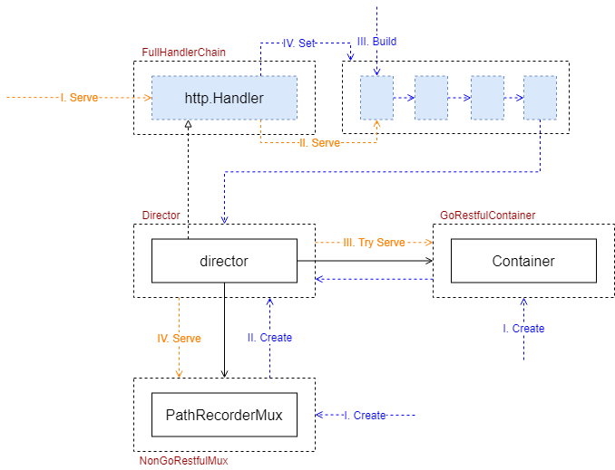

大家好，我是杨鼎睿，这一次给大家带来的是 API Server 的源码阅读。包括之前的 etcd 源码阅读，整个 API Server 共 109 张源码及源码图，文章最后有 API Server 系列目录。欢迎大家的阅读。

本文研究了 Route 部分的源码，配备源码进行进一步理解，可以加深理解,增强相关设计能力。

## APIServerHandler

### Overview
下图为 APIServerHandler 核心组件间关联。主要分为 Restful 和 NonRestful 两部分，director 优先使用 Restful 部分，如果处理成功，则退出，不执行 NonRestful 部分；如果 Restful 部分没有目标功能，则执行 NonRestful 部分。FullHandlerChain 用于 HTTP 处理入口点，链接了中间件功能，并将请求引导至 Director 进行处理。

下面为 APIServer 默认的 HandlerChain 构建过程

[3] API Server
- [API Server Routes](/blog/kubernetes-apiserver-route/)
- [API Server API Group](/blog/kubernetes-apiserver-apigroup/)
- [API Server Storage](/blog/kubernetes-apiserver-storage/)
- [API Server Cacher](/blog/kubernetes-apiserver-cacher/)
- [API Server Etcd](/blog/kubernetes-apiserver-etcd/)
- [API Server Generic API Server](/blog/kubernetes-apiserver-generic-api-server/)
- [API Server CustomResourceDefinitions](/blog/kubernetes-apiserver-crd/)
- [API Server Master Server](/blog/kubernetes-apiserver-master-server/)
- [API Server Aggregator Server](/blog/kubernetes-apiserver-aggregator-server/)
- [API Server API Server Deprecated (暂无)](/blog/kubernetes-apiserver-route/)
