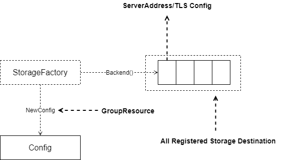
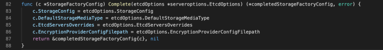
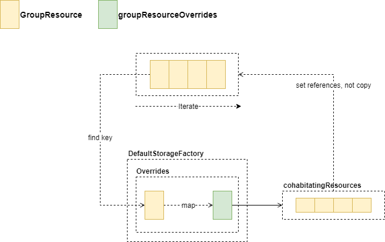
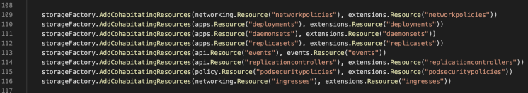
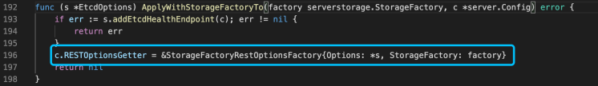
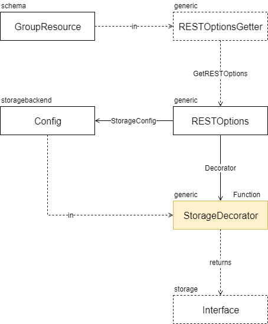
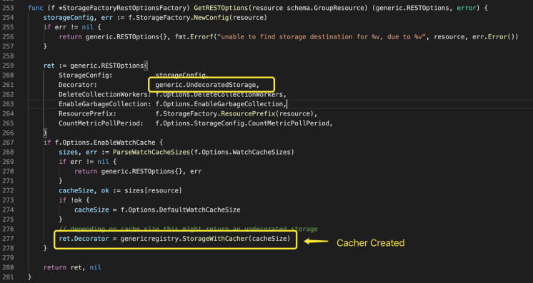
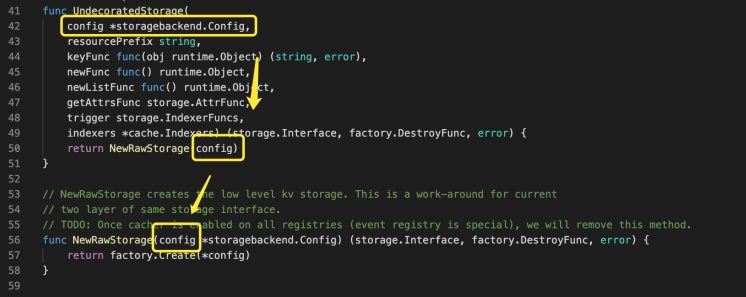
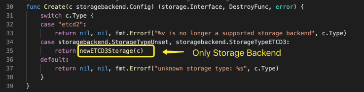

大家好，我是杨鼎睿，这一次给大家带来的是 API Server 的源码阅读。包括之前的 etcd 源码阅读，整个 API Server 共 109 张源码及源码图，文章最后有 API Server 系列目录。欢迎大家的阅读。

本文研究了 Storage 部分的源码，配备源码进行进一步理解，可以加深理解,增强相关设计能力。

## StorageFactory
StorageFactory 的作用是封装并简化对资源的操作。StorageFactory 最主要的作用是根据传入的 GroupResource 获取对应于该资源的存储配置 Config。

在 API Server 中，StorageFactory 由 StorageFactoryConfig 来生成，StorageFactoryConfig 又通过 EtcdOption 来生成，毕竟无论如何变化，etcd 存储才是最终的目的地。

### DefaultStorageFactory
DefaultStorageFactory 是到 1.18 版本前，K8S 内部 StorageFactory 的唯一实现，下面我们来详细分析 DefaultStorageFactory 的模式。

#### Cohabitating Resources

DefaultStorageFactory 将关联的 GroupResource 组织在一起，从上图可以看到，每一个传入的 GroupResource 是按顺序处理的，因此，关联的 GroupResource 间也是有优先级问题存在的。下图为创建 kube-apiserver 时，使用的 StorageFactory 中关联资源的配置情况

### RESTOptionsGetter
Etcd 配置与 StorageFactory 最终都汇入 RESTOptionsGetter 中。RESTOptionsGetter 做为核心配置项，用于通过 GroupResource 找到最终的存储。

创建 storage.Interface 的过程如下图所示

#### StorageFactoryRestOptionFactory
以 StorageFactoryRestOptionFactory 为例，GetRESTOptions 方法步骤如下

- 使用 StorageFactory 生成 Storage Config
- 创建 RESTOptions 结构体，并保存生成的 Storage Config
- 默认使用 generic.UndecoratedStorage 方法作为 Decorator
- 如果开启了 EnableWatchCache 选项，会修改 Decorator

#### UndecoratedStorage
UndecoratedStorage 只使用了传入的 storagebackend.Config 参数

直接调用 factory.Create 创建后端存储

 

[3] API Server
- [API Server Routes](/blog/kubernetes-apiserver-route/)
- [API Server API Group](/blog/kubernetes-apiserver-apigroup/)
- [API Server Storage](/blog/kubernetes-apiserver-storage/)
- [API Server Cacher](/blog/kubernetes-apiserver-cacher/)
- [API Server Etcd](/blog/kubernetes-apiserver-etcd/)
- [API Server Generic API Server](/blog/kubernetes-apiserver-generic-api-server/)
- [API Server CustomResourceDefinitions](/blog/kubernetes-apiserver-crd/)
- [API Server Master Server](/blog/kubernetes-apiserver-master-server/)
- [API Server Aggregator Server](/blog/kubernetes-apiserver-aggregator-server/)
- [API Server API Server Deprecated (暂无)](/blog/kubernetes-apiserver-route/)
