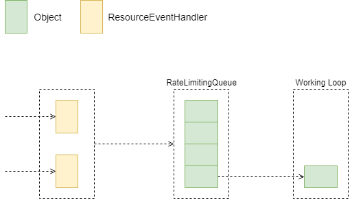
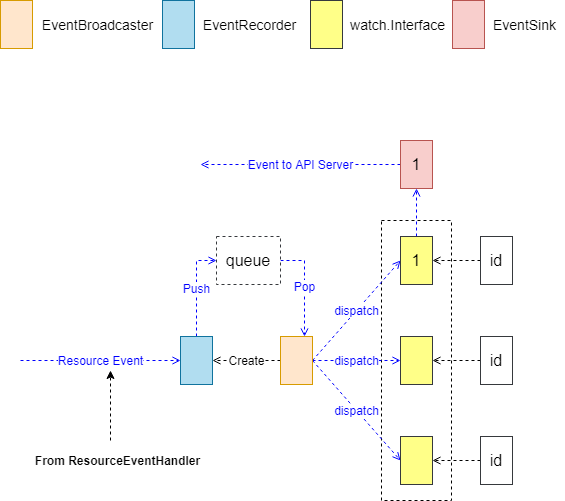
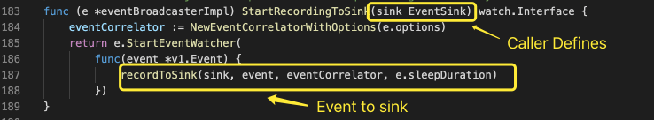
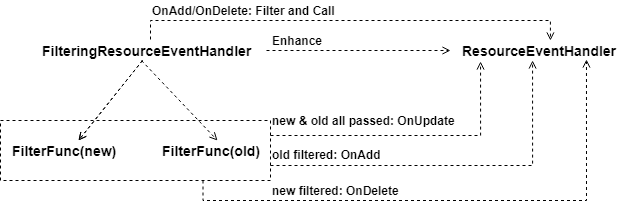

本文研究了 Kubernetes 中 Client 中 Controller  部分的源码，配备源码进行进一步理解，可以加深理解,增强相关设计能力。

## Controller
Controller 内部工作过程为：注册 ResourceEventHandler，事件到达后，存入 Controller 内部 Queue。Worker 协程周期性的从 Queue 中弹出对象，并处理。

### Event Dispatch
Controller 注册的 ResourceEventHandler 将事件分发。分发过程如下图，EventBroadcaster 创建 EventRecorder，事件在 ResourceEventHandler 的处理过程中，根据各自处理逻辑决定是否分发至 EventRecorder 中；如果分发至 EventRecorder，则通过 EventBroadcaster 分发至 watch.Interface。

watch.Interface 根据需要注册在 EventBroadcaster 上，通过 EventBroadcaster 实现对事件的 watch 功能。EventBroadcaster 分发事件时，可选择阻塞式发送方式；也可选择非阻塞式发送，如果发送失败，则 watch.Interface 实例会丢失该事件。

EventBroadcaster 启动 Sink，将 watch.Interface 中获取的事件，回传至 API Server，并记录为 Event 事件。

从上面的分析看：

- EventResourceHandler 是核心处理过程
- EventResourceHandler 在处理过程中，需要其他 Controller 配合、动作事件回传至 API Server
- EventBroadcaster 及 Sink 的作用是将 EventResourceHandler 生成的其他数据，回传至 API Server

## ResourceEventHandler
ResourceEventHandler 处理资源变更事件，该接口包含了 OnAdd/OnUpdate/OnDelete 三个方法。

### Filter Enhancement

- FilteringResourceEventHandler 实现了 ResourceEventHandler 接口
- 包含一个 FilterFunc 和一个 ResourceEventHandler 实例
- OnAdd/OnDelete 时
   - 先执行 FilterFunc，如果失败则退出
   - 触发 ResourceEventHandler
- OnUpdate 时
   - 分别对传入的 old、new 对象执行 FilterFunc
   - old，new 均通过 FilterFunc，触发 ResourceEventHandler 的 OnUpdate  方法
   - old 被过滤，触发 ResourceEventHandler 的 OnAdd  方法
   - new 被过滤，触发 ResourceEventHandler 的 OnDelete  方法

本文研究了 Kubernetes 中 Client 中 Controller  部分的源码，是 Client 的第二部分。