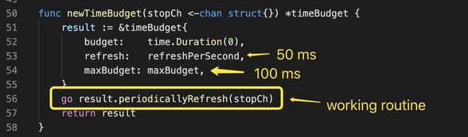
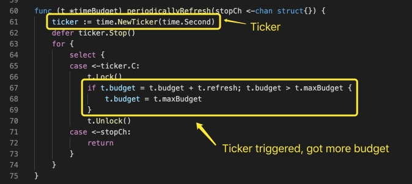

## Definition

### Creation
timeBudget 定义如下  创建代码如下 

## Process

### Bonus
timeBudget 开始运行后，创建了一个工作协程。在这个协程中，_**每秒会触发一次增加预算**_的操作，如果预算大于上限，则取上限。 

### Take & Return
takeAvailable 一次性获取全部预算，并重置预算；returnUnused 归还剩余的预算。  

