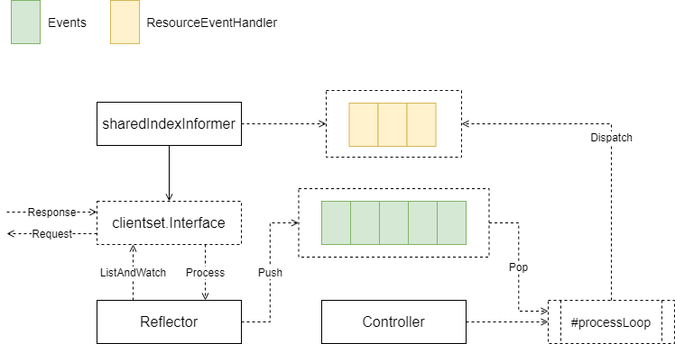
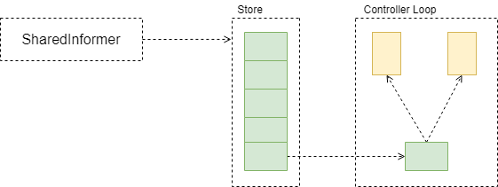
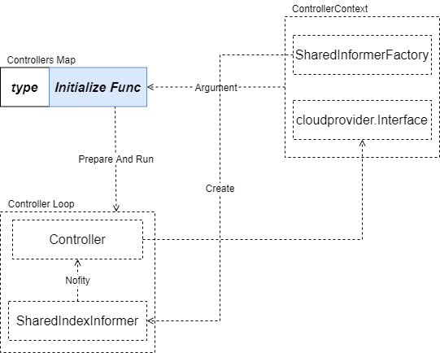
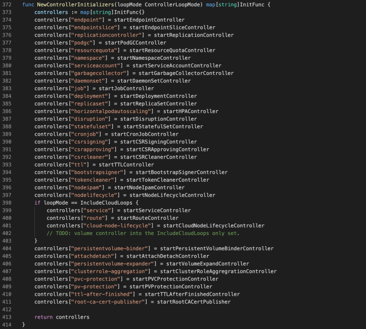

大家好，我是杨鼎睿，这一次给大家带来的是 Controllers 的源码阅读。

## Starting Controller
Controller 启动过程是类似的，首先创建到 API Server 的客户端连接 clientset.Interface，它包含了访问 API Server 不同类型资源的客户端。

然后，启动 SharedInformer 接口实例，伴随其启动的，还有一个 Controller 实例。Controller 定期从 API Server 获取资源变更，并存入 Store 实例中。Controller 的 processLoop 协程，从 Store 中顺序读取资源变更事件，并交由 sharedIndexInformer 实例处理，最终到达 ResourceEventHandler。

Controller 实现的核心，在于其对监听资源的变更处理方法上。

简化后的工作流如下图

## Controller Manager
Controller Manager 负责启动 Controllers。通过注册不同类型 Controller 的初始化方法，并创建 ControllerContext，隔离了 Controller 具体实现。

**Controller Manager ---Create--> ControllerContext ---Pass--> Initialization Function**

1.18 版本，注册的 Controller

[6] Controllers
- [Controllers Queue](/blog/kubernetes-controller-queue/)
- [Controllers](/blog/kubernetes-controller-controllers/)
- [Endporint Controller](/blog/kubernetes-controller-endpoint-controller/)
- [Namespace Controller](/blog/kubernetes-controller-namespace-controller/)
- [Node Controllers](/blog/kubernetes-controller-node-controllers/)
