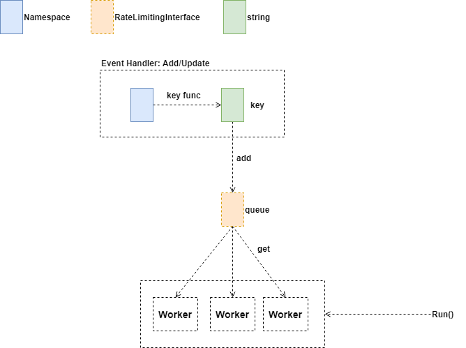
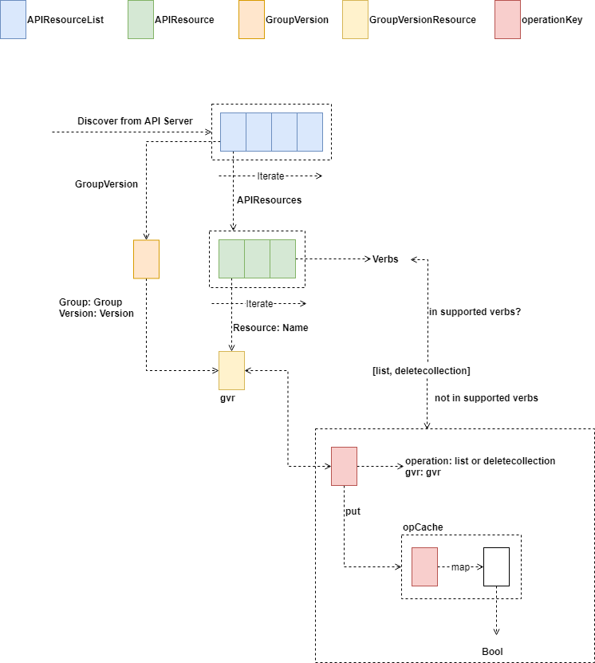
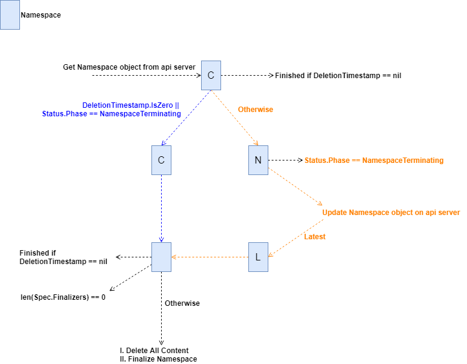
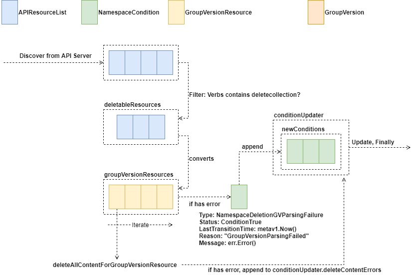

大家好，我是杨鼎睿，这一次给大家带来的是 Namespace Controller 部分的源码阅读。

## Procedure

NamespaceController 结构体中包含 RateLimitingInterface 示例，当从 Informer 监听到时间变更时，触发的 Event Handler 将事件对象转换为 key 值，并存入 RateLimitingInterface 实例中。

NamespaceController 在启动运行时，会根据要求，启动多个协程，这些协程都执行相同的功能：从 RateLimitingInterface 实例中获取 key 值，并做处理。

## NameResourcesDeleterInterface

### Initialize Unsupported Operations
使用 Discover Client 获取服务端支持的全部 Resource 列表，并根据 Resource 是否需要归属于Namespace 来进行过滤，不需要关联于 Namespace 的资源被过滤。

将获取到的 Resources 进行遍历，根据 GroupVersion 进行分类，并获取该资源支持的操作列表(Verbs)，将不支持 **list、deletecollection** 操作的 Resource 记录下来。

### Delete

#### Delete All Content

