大家好，我是杨鼎睿，这一次给大家带来的是 Node Controllers 部分的源码阅读。

## IPAM Controller
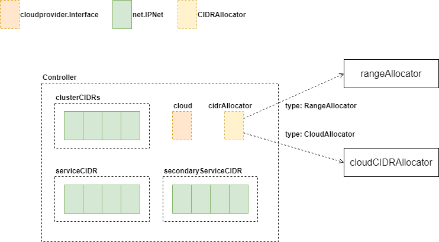

IPAM Controller 在 K8S 1.18 中有四种类型的 CIDRAllocator，分别为：RangeAllocatorType、CloudAllocatorType、IPAMFromClusterAllocatorType 及 IPAMFromClusterAllocatorType。

Controller 在 RangeAllocatorType 或 CloudAllocatorType 模式下，cidrAllocator 有具体指向的结构体负责处理 IPAM 逻辑。

Controller 在 IPAMFromClusterAllocatorType 或 IPAMFromClusterAllocatorType 模式下时，启动 ipam.Controller 来处理，但 K8S 1.18 代码中，仅支持 GCE。

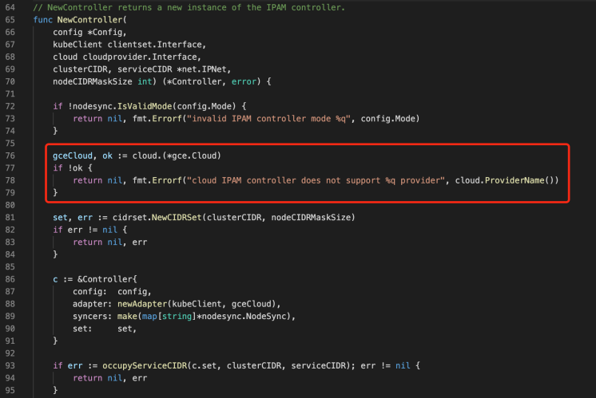

再来看一下 Controller 的 Run 方法，如果类型为 RangeAllocatorType、CloudAllocatorType 时，启动 cidrAllocator 的 Run 方法。

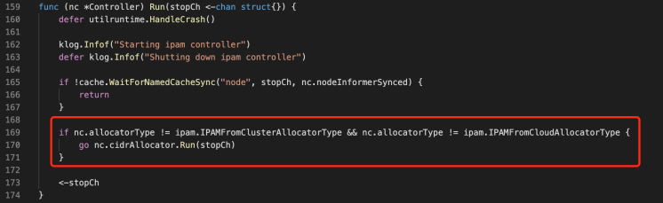

### Range Allocator

#### Node List Initialization

Range Allocator 启动时，Node 有可能已启动完毕，因此，需要获取全部 Node，并标注使用的 IP 地址。根据 Node.Spec.PodCIDRs 获取 IPNet 后，使用如下方法获取索引值。

获取到起始位置后，设置 CidrSet 中对应位，防止重复使用。

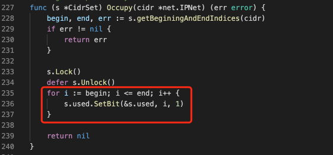

#### On Node Created
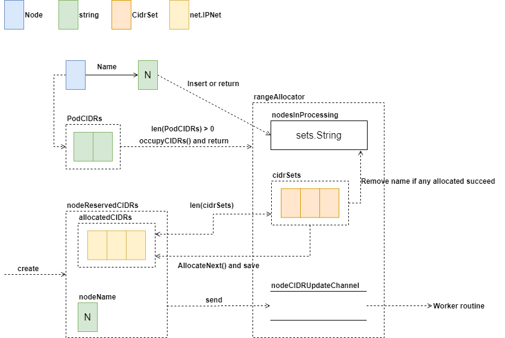

nodesInProcessing 中存储正在处理的 Node 名称，新 Node 到达时，如果在其中已经存在该名称，说明该节点正在处理中，直接退出处理程序。

如果 Node 的Spec 中 PodCIDRs 不为空，直接更新 rangeAllocator 中 IP 使用位图即可；如果为空，则创建 nodeReservedCIDRs 结构体，并使用 rangeAllocator 分配 IP，只要有一个 IP 分配成功，那么从 nodesInProcessing 移除该 Node。最后，将新创建的 nodeReservedCIDRs 发送至 Worker 协程处理。

#### On Node Update
根据 Node 最新状态下 Spec 中 PodCIDRs 长度，决定是要执行的操作，如果长度为零，等同于创建操作，否则直接退出。

#### On Node Delete
创建 Node 的逆操作，将占用的 IP 资源释放，根据 Node 配置，遍历 PodCIDRs，将占用的资源逐一释放。

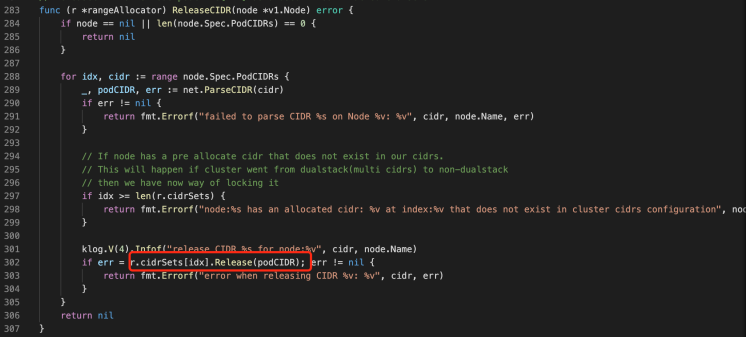

相对于创建时的置 1 操作，释放资源时使用清 0 操作

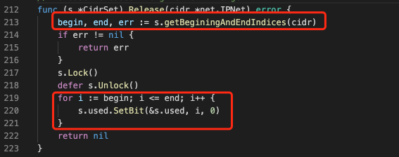

#### Update CIDR Allocation
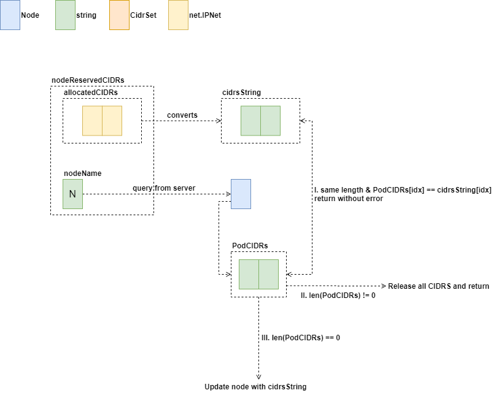

在 Node 创建事件回调方法中，曾创建一个 nodeReservedCIDRs 并被发送至 Channel 中。在 Worker 协程中，会捕获该结构，并做处理。具体来说，先根据 Name 从 API Server 端获取 Node 最新信息，根据最新信息中的 PodCIDRs 与 该结构体中预留的 CIDR 对比：

- 长度相同，且每个 IP 信息均相同，则处理完毕
- 上述条件不满足，且 PodCIDRs 长度不为 0，则释放全部 CIDR 资源，并退出
- PodCIDRs 长度为零，那么意味着该 Node 尚未包含 CIDR 资源，分配 CIDR，并通知 API Server，如果成功，则退出；如果 API Server 响应超时，则释放预留 CIDR 资源，退出

Worker 协程中，如果上述处理返回错误，则将 nodeReservedCIDRs 重新发送至 Channel，以待下次处理。

## Node Lifecycle Controller

### Pod Change Handling
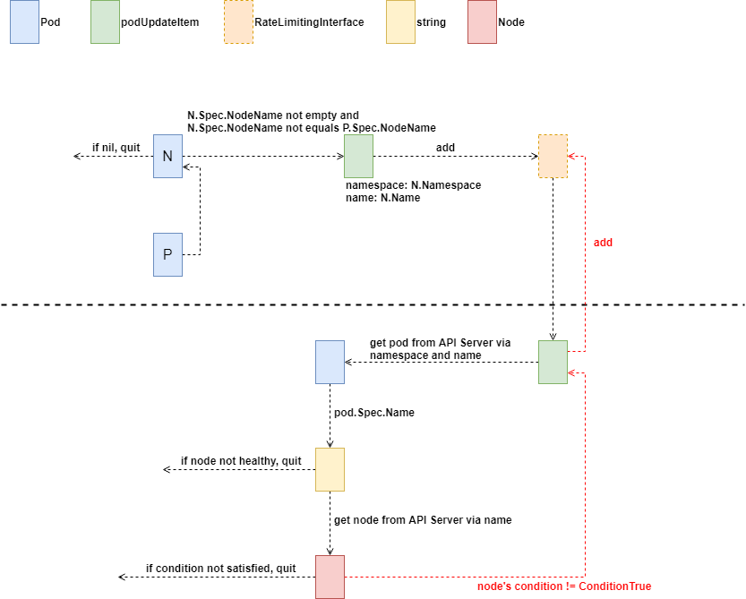

监听到 Pod 变化时，将 Pod 变化情况包装为 podUpdateItem，并放入队列。Pod 变更处理协程从队列中获取到该实例，并处理 Pod 变更情况。如果处理成功，在队列中移除该实例，如果失败，重新将该实例放入队列，以待下次处理。

变更监听代码如下所示，将 Create/Update/Delete 统一至相同方法 podUpdate 中进行后续处理，类似手法已经在之前章节有详细说明，这里不再赘述。

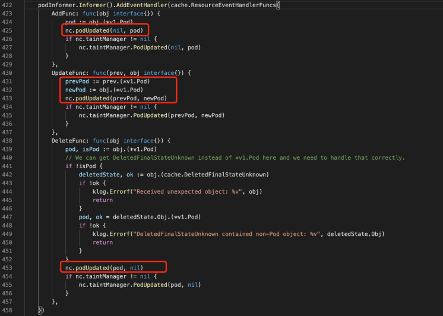

### Node Change Handler
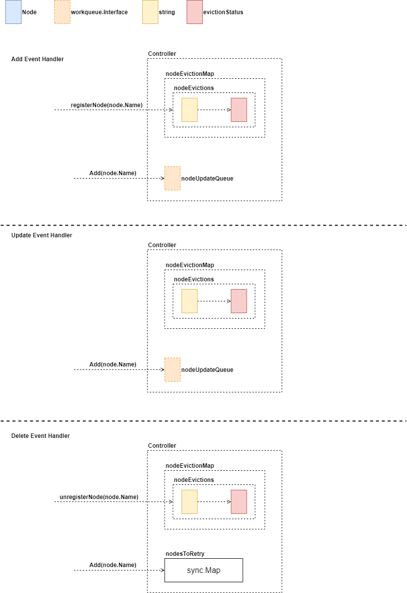

### Node Processing

#### No Scheduler Taint
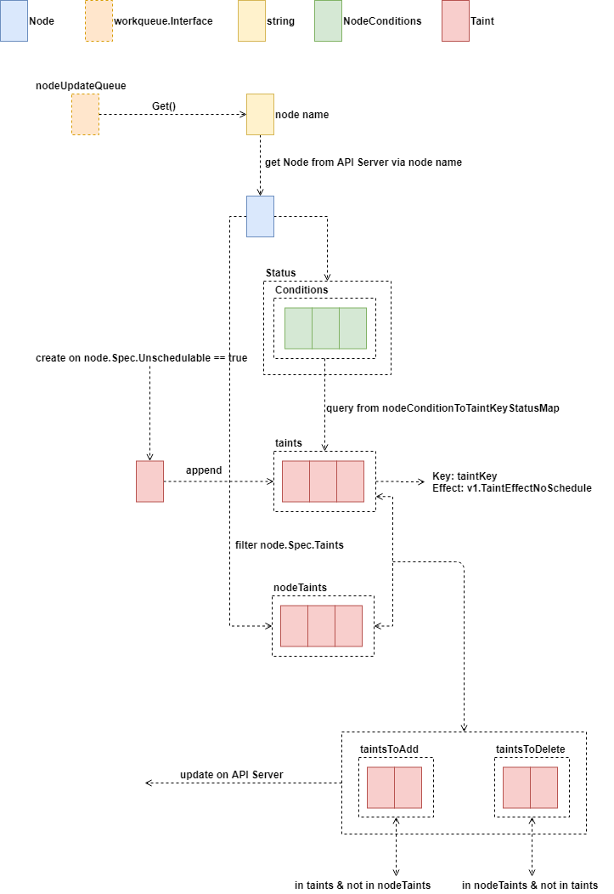

遍历 Node.Status.Conditions，并根据 Condition.Type 在 nodeConditionToKeyStatusMap 中获取到相应信息。nodeConditionToKeyStatusMap 内容如下

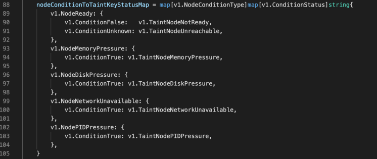

获取时如下所示

