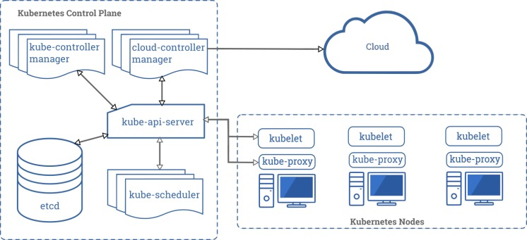

## Architecture

### Container

### Components

## 备注

大家好，这一次给大家带来的是 Kubernetes 的源码阅读。

源码设计图需要配合源码使用，除展示关键设计外，还会有问题性的留白。阅读图的时候发现存在问题的，带着问题去看源码，看别人如何设计解决的，会提高设计能力。

如果发现图片模糊的情况，可能是图片压缩所致，可以联系我进行 svg 的调换

图作者：[Abserari](https://yuque.com/abser)，[Oiar](https://yuque.com/oiar)
