<a name="O03PI"></a>
## Iptables
<a name="1If4d"></a>
### References

- [Man Page of Iptables](https://ipset.netfilter.org/iptables.man.html)
- [Iptables Extensions Manual](https://ipset.netfilter.org/iptables-extensions.man.html)
- [How To Implement a Basic Firewall Template with Iptables on Ubuntu 14.04](https://www.digitalocean.com/community/tutorials/how-to-implement-a-basic-firewall-template-with-iptables-on-ubuntu-14-04)
- [How To Forward Ports through a Linux Gateway with Iptables](https://www.digitalocean.com/community/tutorials/how-to-forward-ports-through-a-linux-gateway-with-iptables)
- [Iptables HowTo](https://help.ubuntu.com/community/IptablesHowTo#Saving_iptables)


<a name="vCb5x"></a>
### Packet Flow

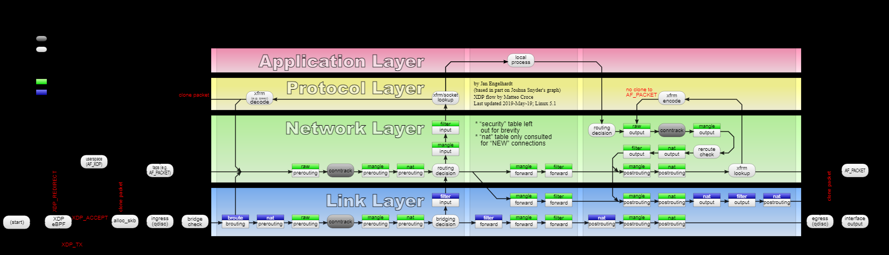<br />**图片来源：维基百科 **[**iptables**](https://en.wikipedia.org/wiki/Iptables)<br />

<a name="yIra6"></a>
### Table & Chain

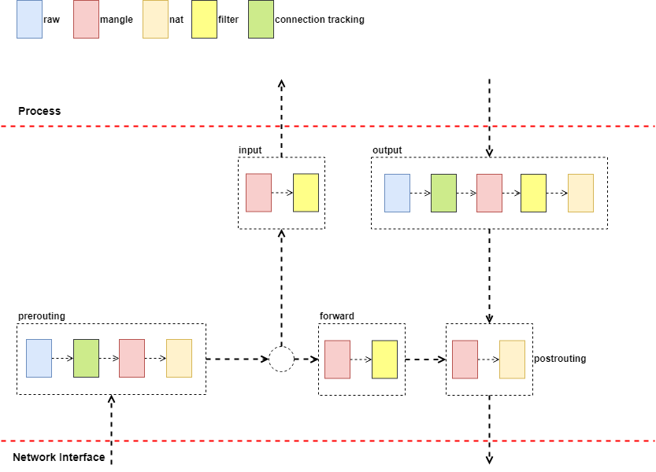<br />Chain 如上图中虚线方框所示，代表了包处理过程中，实际的规则执行路径。Table 是可简单理解为规则的分类：

- Raw：Connection Tracking 相关操作
- Mangle：修改 IP 包
- Nat：地址转换
- Filter：过滤

<br />
<a name="mt3vv"></a>
## Proxier
<a name="jWkGY"></a>
### Monitoring Routine

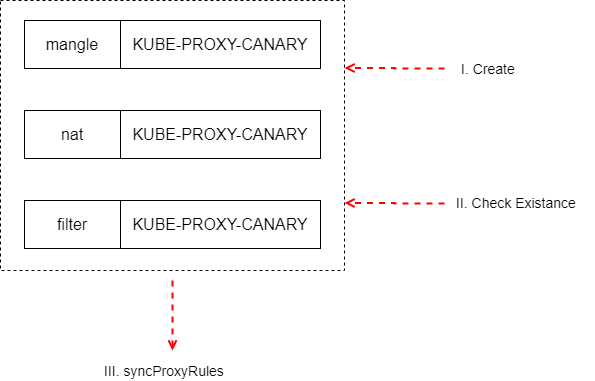<br />创建 Proxier 结构时，启动了一个协程，用于确保上图的 Table、Chain 都是存在的，然后执行同步规则方法。如果检查存在性时失败，则删除全部的 Table 及 Chain。创建 Table、Chain 成功后，才会执行 syncProxyRules 方法。<br />Proxier 的 SyncLoop 启动时，注册了 syncProxyRules 的 BoundedFrequencyRunner 也同时启动，可以通过 Sync 方法，触发 syncProxyRules 方法执行，需要注意 BoundedFrequencyRunner 通过令牌桶算法，限制其运行方法的执行频率。

<a name="aHJrJ"></a>
### Service Change Handling
<a name="59KaO"></a>
#### ServiceMap

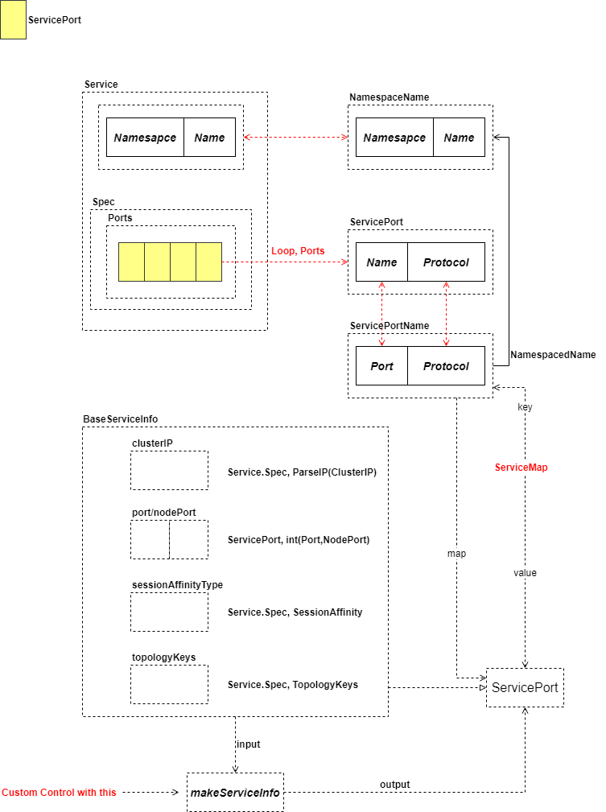<br />Service 到 ServiceMap 过程如上图所示，LoadBalancer 部分没有在图中标注。如果需要定制化操作，可以通过自定义 makeServiceInfo 方法来实现。ServiceMap 是 iptables 模式下的核心结构之一。

<a name="ZXs9d"></a>
#### Service Change Track

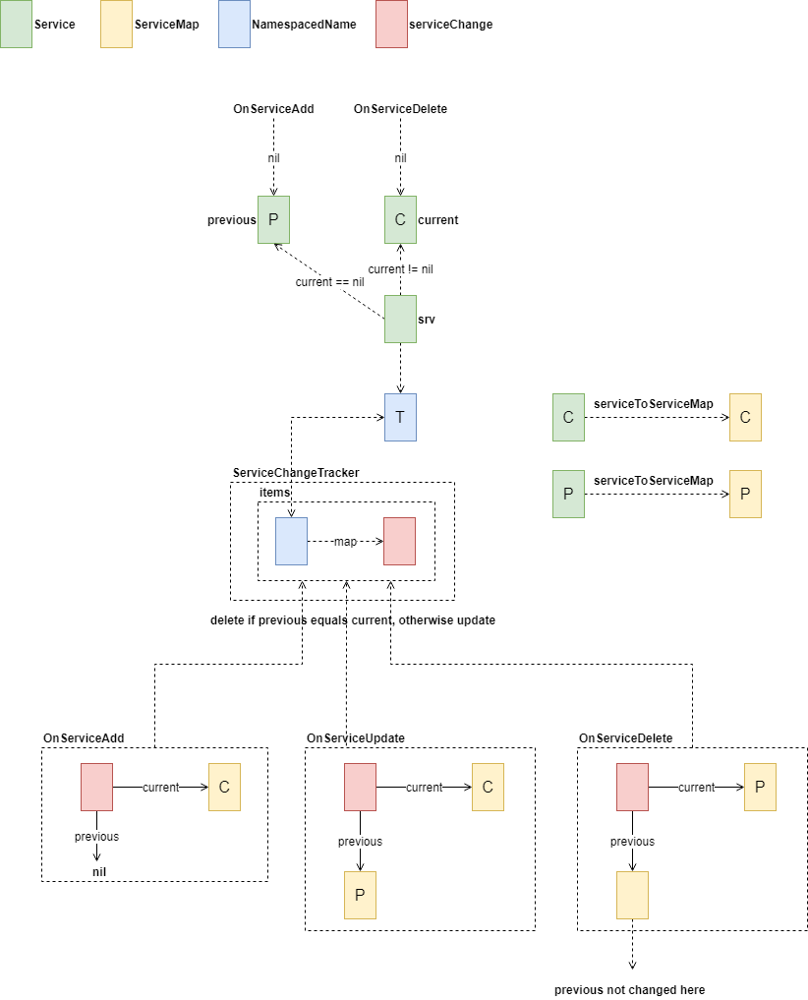<br />Service Informer 触发后，由 proxy.Provider 来处理。在 iptables 模式下，处理最终落在 ServiceChangeTracker 的 OnServiceAdd/Update/Delete 方法上。三个方法使用简单的技巧，统一为 Update：

- Create 时调用 OnServiceUpdate(nil, service)
- Delete 时调用 OnServiceDelete(service, nil)


在 ServiceChangeTracker 的 Update 方法中，将当前 Service 对象与前次的 Service 对象分别对应的 ServiceMap 做比较，决定其在 ServiceMap 中的去留，规则如下

- 同一 Service 对应的 NamespacedName 对象相同
- 如果 previous 与 current 保存的 ServiceMap 内容相同，则删除，否则更新
- Create 时，current 为 Service 对应的 ServiceMap，previous 为 nil
- Update 时，更新 current，不改变 previous
- Delete 时，更新 current，不改变 previous

<br />
<a name="yrq40"></a>
### Endpoint Change Handling

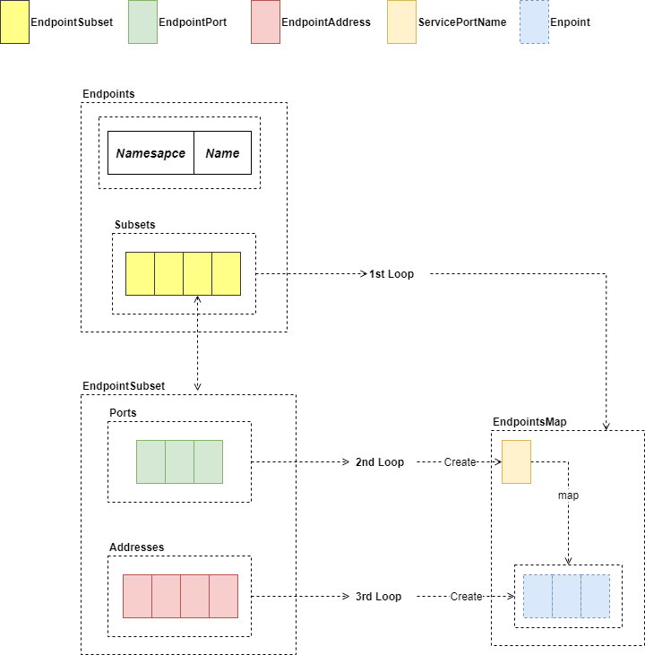<br />Endpoints 处理逻辑与 Service 基本一致，不同指出在于 Endpoints 中包含的 Ports 与 Addresses 可自由组合。同样的，可以通过自定义 makeEndpointInfo 获取 Endpoint 接口对象，这里的 Endpoint 接口，是 Proxy 中使用的，不是 Kubernetes 的资源对象。

处理 Endpoints 变更方法与 Service 并无本质区别，只是将 previous 与 current 指向的对象更根为 EndpointsMap。

<a name="nqffw"></a>
### Node Change Handling
Node 资源变更处理相对简单，只要变更 Proxier 的 nodeLabels 即可，以 OnNodeAdd 为例<br />

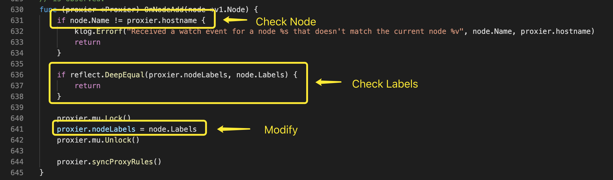<br />OnNodeUpdate 使用新 Node 对象的 Labels；OnNodeDelete 则将 nodeLabels 设置为 nil。

<a name="D8981"></a>
## Sync Proxy Rules
原则上，Service、Endpoints(EndpointSlice) 任何一个的变更都会触发 syncProxyRules 的执行，但是，不要忘记 BoundedFrequencyRunner 限制调用频率的存在，因此，在执行规则同步时，有可能存在 Service、Endpoints(EnpointSlice) 同时变更的可能性。<br />Service、Endpoints、Node 的变更，全部 kube-proxy 都会收到，后续的处理如果没有特殊说明，每个 Node 都会处理。

<a name="d8LdQ"></a>
### ServiceMap

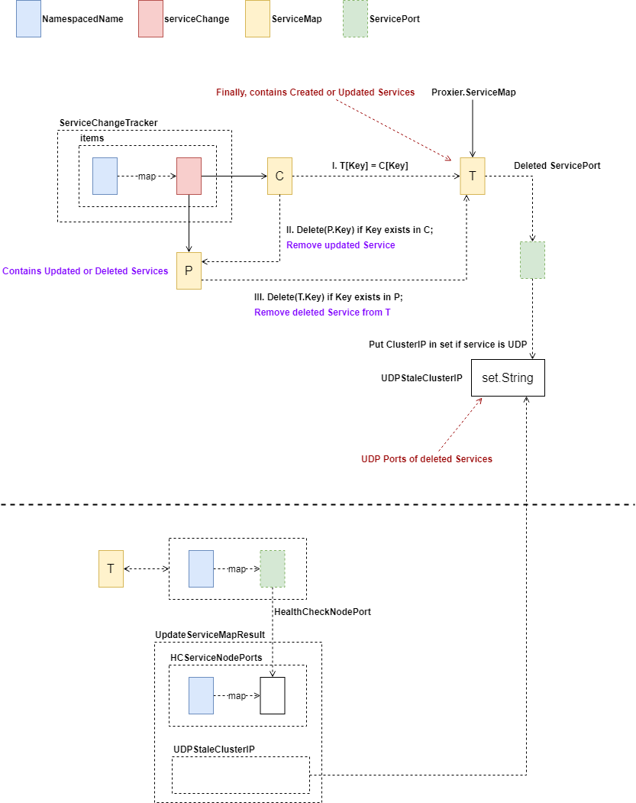<br />将检测到的 Service 变更情况更新至 ServiceMap 中，已删除的 Service 如果包含 UDP 协议的端口，保留下来。<br />最终得到了所有 Created、Updated 的 ServiceMap、已删除的 UDP 端口及到目前为止仍然存活的 Service 的健康检查端口。

<a name="d06Am"></a>
### EndpoinsMap

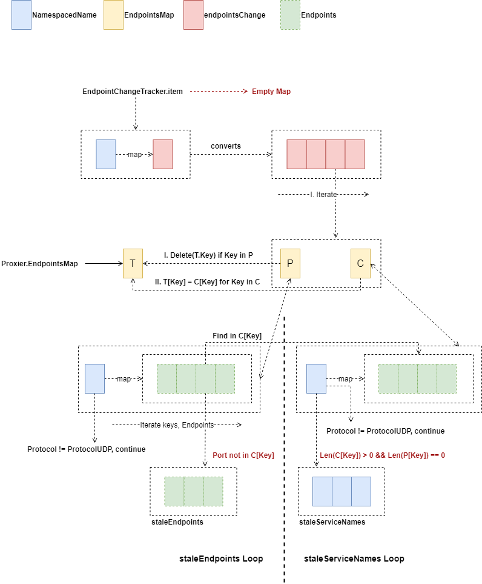<br />将 Endpoints 变更应用到 EndpointsMap 上，上图是没有开启 EndpointSlice 特性时的情况。不同于 ServiceMap 处理之处在于保留的是本地健康的 Endpoint IP 数量。<br />
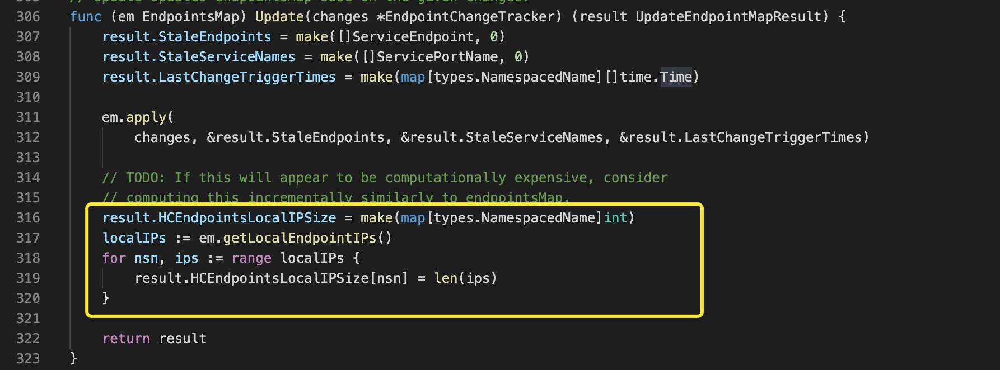<br />然后，将 staleServiceNames 合并至由 Service 变更引起的 staleServicesClusterIP 中，这样，全部变更的 Cluster IP 获取完毕。<br />
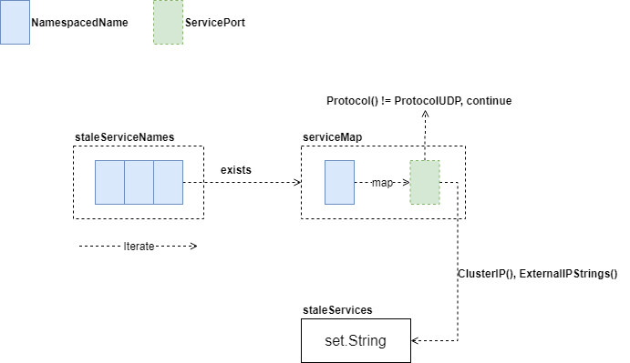

<a name="hFl2L"></a>
### Jumping Chains

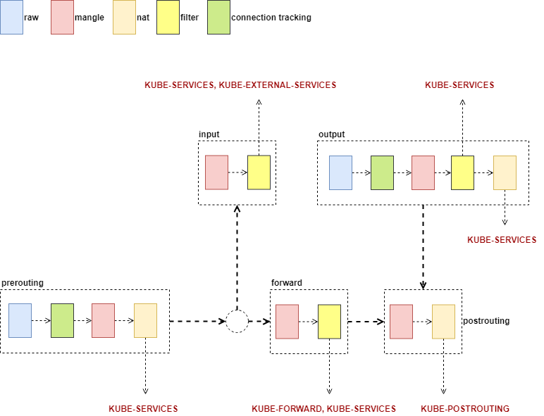<br />创建了如下的自定义链并将默认链处理对应至自定义链

- Nat
   - KUBE-SERVICES
   - KUBE-POSTROUTING
- Filter
   - KUBE-SERVICES
   - KUBE-EXTERNAL-SERVICES
   - KUBE-FORWARD

<br />
<a name="jmqkw"></a>
### Iptables Save Format
```
# Generated by iptables-save v1.3.1 on Sun Apr 23 05:32:09 2006
*filter
:INPUT ACCEPT [273:55355]
:FORWARD ACCEPT [0:0]
:LOGNDROP - [0:0]
:OUTPUT ACCEPT [92376:20668252]
-A INPUT -m conntrack --ctstate RELATED,ESTABLISHED -j ACCEPT
-A INPUT -i eth0 -p tcp -m tcp --dport 22 -j ACCEPT
-A INPUT -i eth0 -p tcp -m tcp --dport 80 -j ACCEPT
-A INPUT -i lo -j ACCEPT
-A INPUT -j LOGNDROP
-A LOGNDROP -p tcp -m limit --limit 5/min -j LOG --log-prefix "Denied TCP: " --log-level 7
-A LOGNDROP -p udp -m limit --limit 5/min -j LOG --log-prefix "Denied UDP: " --log-level 7
-A LOGNDROP -p icmp -m limit --limit 5/min -j LOG --log-prefix "Denied ICMP: " --log-level 7
-A LOGNDROP -j DROP
COMMIT
# Completed on Sun Apr 23 05:32:09 2006
```


<a name="e4axB"></a>
### Prepare Chains & Rules
在根据 ServiceMap 处理规则前，先使用 iptables-save 格式确保以下的 Chain 存在

- Filter
   - KUBE-SERVICES
   - KUBE-EXTERNAL-SERVICES
   - KUBE-FORWARD
- Nat
   - KUBE-SERVICES
   - KUBE-NODEPORTS
   - KUBE-POSTROUTING
   - KUBE-MARK-MASQ

添加 nat 规则<br />
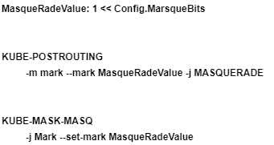

<a name="NIrkZ"></a>
### Handling ServiceMaps
<a name="18md9"></a>
#### Cluster IP

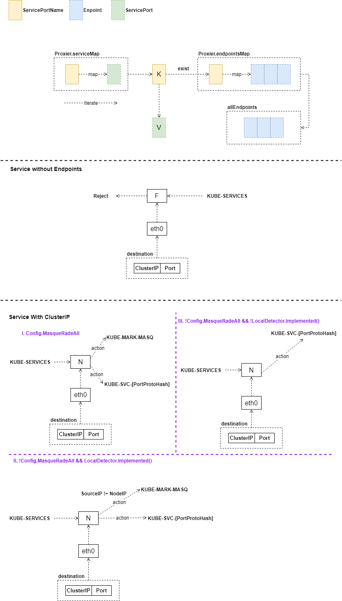<br />无 Endpoints 的服务，Node 在接收到请求后，直接拒绝，因此规则添加在 Filter 表；Cluster IP 要根据配置进行 NAT 转化。<br />

<a name="14izD"></a>
#### External IPs

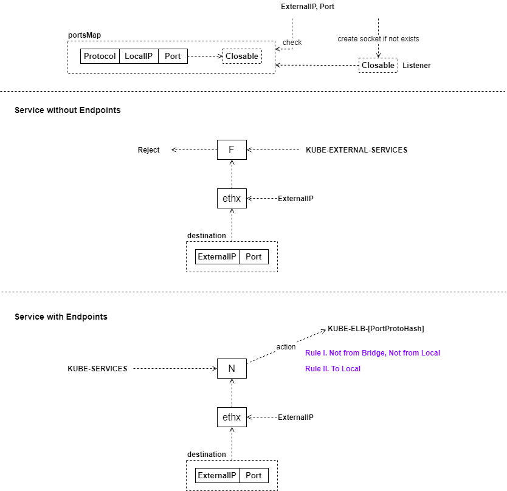<br />

<a name="DkiUH"></a>
#### Load Balancer Ingress

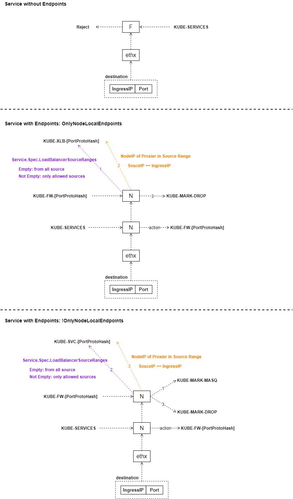<br />是否只有本节点 Endpoints 判断代码如下所示<br />
<br />

<a name="YX9qe"></a>
#### Node Ports

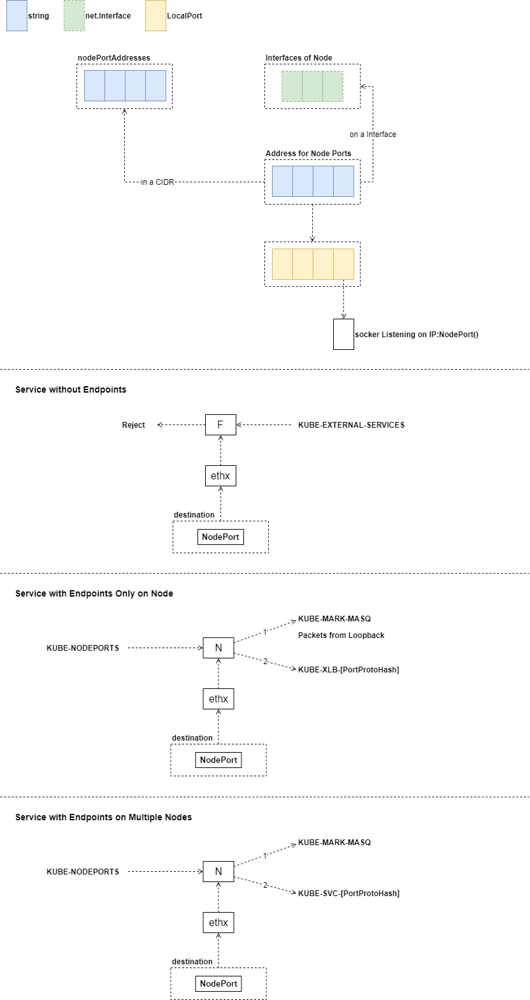<br />处理至此，与服务相关的基本规则均已建立，如果本次循环处理的 Service 没有 Endpoints，那么继续处理下一个 Service；如果有，则继续向下建立 Endpoints 规则。

<a name="JGfj9"></a>
#### Endpoint Chains

<br />处理到此处，Service 对应的 Endpoints 如果不是 NodeOnly，则处理下一个 Service。后续处理，仅对 NodeOnly 的服务起作用。<br />
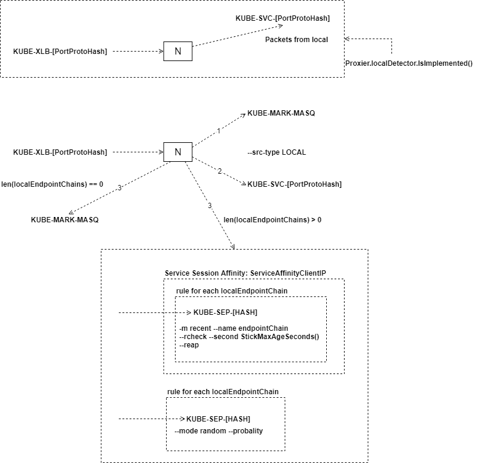

然后，对 Node 上每一个网络接口地址设置如下规则<br />
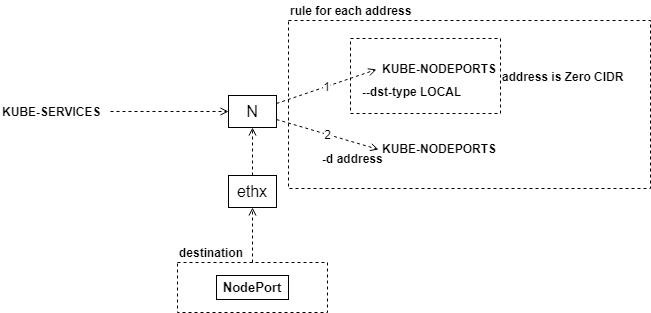<br />最后，设置 KUBE-FORWARD 上规则如下<br />
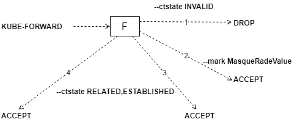
