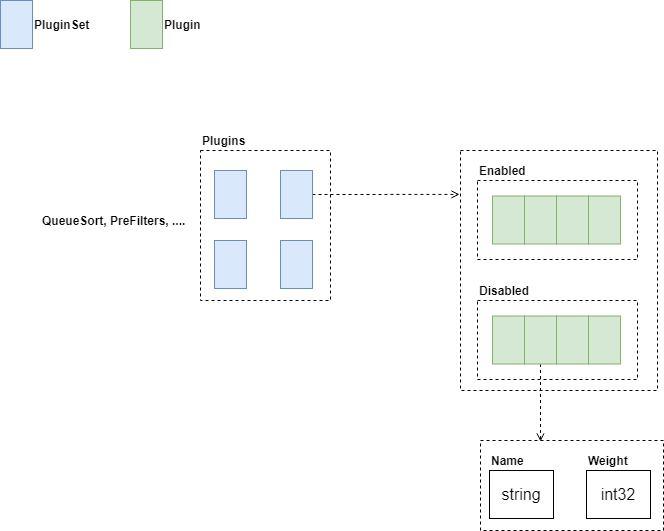
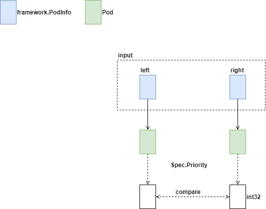
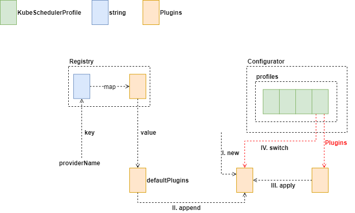
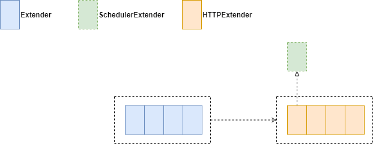
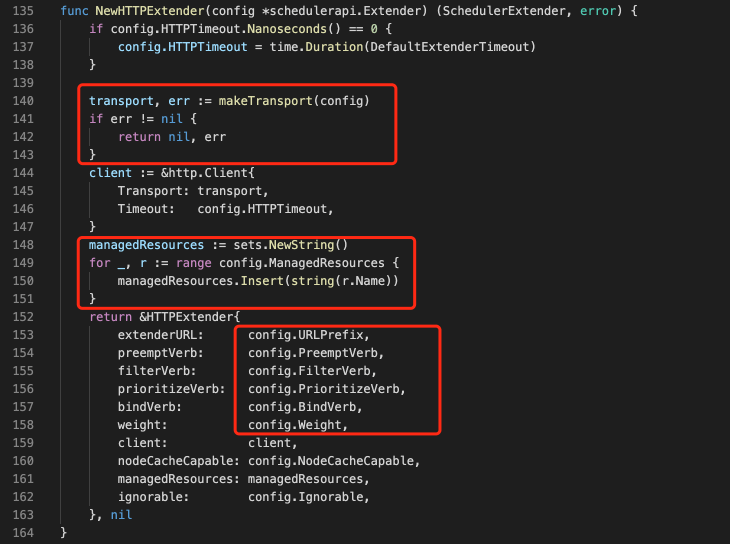

本文研究了 Kubernetes 中 Plugins 部分的源码，配备源码进行进一步理解，可以加深理解,增强相关设计能力。

## Basic Structures

### Plugins

Plugins 包含了一组 PluginSet，每个 PluginSet 又包含了两组 Plugin，一组为激活状态，一组为禁用状态。Plugin 包含一个唯一标识符和该 Plugin 的权重。

### Quick Sort Plugin

接口方法 Less 如上图所示，传入两个 PodInfo 实例，通过 Less 方法判定二者在排序时先后位置。由于 Plugin 接口只有通用方法 Name，因此，每个特定功能的 Plugin 原则上可随意定制自己需要的方法。

### InterPodAffinity

将与当前调度 Pod 的相关 Node 数据存储在 CycleState 的 PreFilterInterPodAffinity 关键字中，供后续调度使用。

## Configurator

### Profile
Registry 用于组织 provider 与 Plugins 间关联关系，保存的是默认的 Plugins。在创建 Profile 结构时，会使用这些默认的 Plugins。

#### 

### Extender

相关代码如下图所示

### Profile Map

本文研究了 Kubernetes 中 Plugins 部分的源码，是 Scheduler 的第三部分。