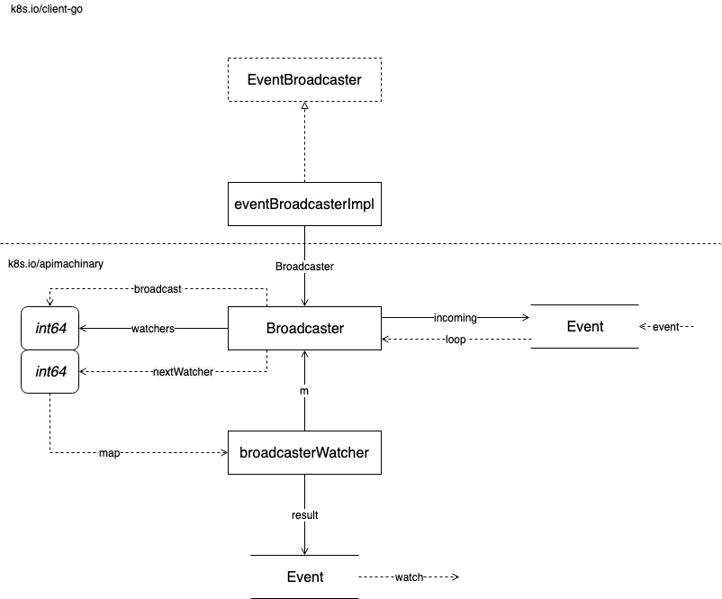

## Landscape

### References

- [EventBroadcaster](https://sourcegraph.com/github.com/kubernetes/client-go@release-12.0/-/blob/tools/record/event.go#L113:6)

## EventBroadcaster

### Implementation

#### EventCollerator

#### Event Recorder

### References

- [watch.Broadcaster](https://sourcegraph.com/github.com/kubernetes/apimachinery@release-1.15/-/blob/pkg/watch/mux.go#L42:6)
- [watch.broadcasterWatcher](https://sourcegraph.com/github.com/kubernetes/apimachinery@release-1.15/-/blob/pkg/watch/mux.go#L241:6)
- [record.EventAggregator](https://sourcegraph.com/github.com/kubernetes/client-go@release-12.0/-/blob/tools/record/events_cache.go#L181:6)
- [record.recorderImpl](https://sourcegraph.com/github.com/kubernetes/client-go@release-12.0/-/blob/tools/record/event.go#L286:6)
- [v1.EventSource](https://sourcegraph.com/github.com/kubernetes/api@release-1.15/-/blob/core/v1/types.go#L4641:6)
